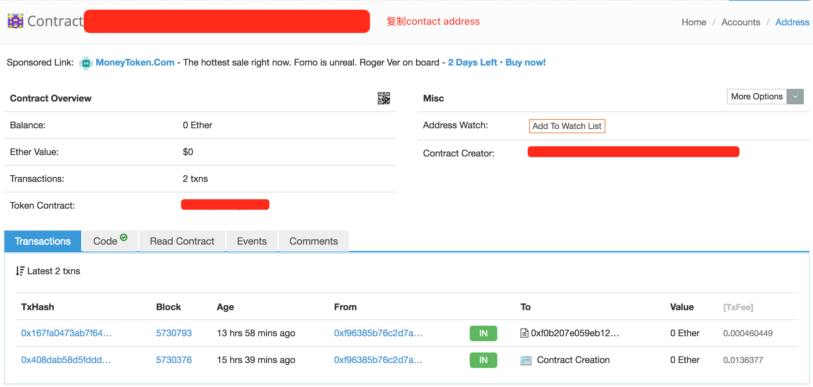

**ERC20 Token**

ERC20是以太坊定义的一个代币标准.要求我们在实现代币的时候必须要遵守的协议，如指定代币名称、总量、实现代币交易函数等，只有支持了协议才能被以太坊钱包支持。

**本攻略手把手教你做一个ERC20 Token,非代码,没有编程基础的人也可以轻松发币**

**工具**
MetaMask插件(chrome浏览器)

Tokenfactory

##Step 1 准备工作
在chrome浏览器安装MetaMask插件

**metamask除了是一个简单的钱包外，它可以使得Chrome浏览器变身成以太坊浏览器，让使用者通过浏览器和以太坊智能合约互动**

##Step 2 账号设置
###2-1
点击chrome浏览器右上角metamask图标，同意隐私条款和使用条款

###2-2
设置metamask账号

###2-3
记下助记词，到这里metamask账号就创建好了

##Step 3 发行代币
###3-1

###3-2
进入下面的网站填写发行信息：http://tokenfactory.surge.sh/#/factory

注意这里我们的发行总量为最小单位的总量，如果想要发型总量为2100w，最小单位为0.0001的token，需要在总量处填写210,000,000,000，最小单位填写4（小数点后4位），点击create token。

如图提示我们本次发行代币的矿工费最多是0.02eth, 你可以通过改变Gas价格来调高或者降低费用，gas价格越高，执行速度越快。

**点击提交，恭喜你发行了自己代币！剩下的就是等待了。**

##Step 4 交易代币
###4-1
在https://etherscan.io/ 查询你的metamask eth地址，找到所有交易中contract creation这一笔。

点击contract creation之后页面如下，复制你的token contract address。

###4-2
将复制好的地址贴进 http://tokenfactory.surge.sh/#/tokensearch 后点击确认，会进入如下页面：

第一个窗口是转账窗口，现在你可以向其他用户转账啦！

(注: 由于发行的是在以太坊上的erc-20代币，所以转账需要花费eth)