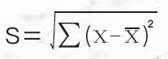

## 一、MAC多原链的介绍

### 1.1 MAC多原链简介
&emsp;&emsp;Multiple Atomic Chain（简称MAC，多原链）是开发在比特币和以太坊之外的第三种区块链底层生态系统，致力于拓展区块链技术的商业应用边界和技术边界，让大众用户用户能够真实的感受到区块链技术的价值，让区块链不在停滞于学术理论层面而是更加直接的应用到开发应用的实践中去，多原链的开发将是商业应用和区块链技术碰撞的火花，也是对区块链现有技术的一种挑战，跳跃出了现有技术领域思维，为区块链3.0生态应用体系的开创先锋。

&emsp;&emsp;在多原链系统中，可以通过价值传输协议来实现点对点的价值转移，高性能、高吞吐量、快速安全是多原链的特性，从而用多原链的底层构建出一个支持多个行业领域（金融、物联网、供应链、社交、游戏、电商、溯源、交易等）的去中心化的场景应用开发生态平台。

&emsp;&emsp;在多原链的公链（PublicBlockchain) 系统中，全世界任何人都可读取、任何人都能发送交易且交易能获得有效确认、任何人都能参与其中共识过程的区块链（共识过程决定哪个区块可被添加到区块链中和明确当前状态）。作为中心化或者准中心化信任的替代物，公共区块链的安全由“加密数字经济”采取工作量证明机制或权益证明机制等方式，将经济奖励和加密数字验证结合了起来，并遵循着一般原则：每个人从中可获得的经济奖励，与对共识过程作出的贡献成正比。这些区块链通常被认为是“完全去中心化”的。

&emsp;&emsp;在多原链的联盟链中（Permissioned Blockchain) 我们将采用多原链开发者提出的与Raft融合的Proof of Time 共识协议，使得在联盟链或者私链中，达成共识的时间大大缩短。在多原链系统中，我们把区块链合约（Blockchain Contract) 分成智能合约（Smart　Contract) 和主控合约（Master Contract) 除了支持智能合约外，我们将通过链下因素的引入，形成符合现实世界商业逻辑的区块链主控合约。

&emsp;&emsp;在多原链系统中，我们也通过Oracle 和Data Feed 的设计，并在此基础上做了改良和优化，通过实现智能合约的多样合理化更加的符合商业级的应用需求，搭建了现实世界到区块链世界的桥梁，可以通过智能合约来管理参与者的身份信息，将为基于多原链公有链系统的各行业服务提供更好的支持。最后面向移动端策略也是多原链特别重视的一个战略，在多原链的生态系统中，我们将会与第三方开发者，一起从技术架构支持提供移动端的服务，包括：移动端钱包、移动端DAPP应用、移动端智能合约服务。我们也鼓励第三方的开发者，加入我们MAC开发者生态社区，一起开发区块链的移动端服务，共同推动区块链技术的落地。

&emsp;&emsp;多原链开创了多项创新，突破了传统共识层面的思维，从核心算法层面进行了深度研究及挖掘，并创了独立的自主知识产权技术，如“异步排序响应（Asynchronous Sorting) ” “连续型抽取共识（CHNN-Consensus Mechanism) ”“模拟神经元系统合力决策（Neuron) ”等多项算法核心突破技术，从而能够达到高速的TPS以及稳定的系统并发性能，多原链开发团队坚信，只有好的性能才能将区块链技术真正的实现从理论阶段到应用阶段的转型，多原链团队在开发阶段不断的以追求性能为宗旨，打造出了高性能且能实现多种商用开发的底层公链MAC，重塑了区块链生态，真正的开创了区块链3.0的开发应用新时代。

### 1.2 多原混合共识机制及跨链原子操作
&emsp;&emsp;多原链是一条基于比特币和以太坊系统之外开发的主链，多链共识，多链并行，多原混合共识机制【1】及跨链原子操作【2】构建高速跨链资产流通公路，共识机制方面集成了NDPOS、DPOS、POS、POW、PBFT的优势，通过算法反推共识将共识机制打散且通过异步排序及离散转连续的方式进行择优选取，不需在共识过程中与大多数节点连接，并获取投票，节省系统数据传输，降低节点对网体依赖，节点随机选择，使用随机可计算函数，用户根据计算得知其是否被选择中， 并将结果反馈和广播给其它用户， 多原混合机制（ Multiple Hybrid ConsensusMechanism)从共识层面将优势放大提高TPS的速度，我们团队进行研发的时候发现，单单的通过传统的共识层面去提高TPS， 都是受限制的， 传统的共识机制不管是POW/POS/DPOS/NDPOS以及PBFT单一的共识机制经过多次运算都无法实现质的突破，所以我们通过算法反推并运用独创技术【1】【2】将共识打散并择取优势部分，从而使TPS进行了质的突破。有人说TPS不能作为区块链发展的唯一命题，但是我们MAC团队坚信区块链作为一种技术必须还是要落实到实际应用中，那这其中就包含了大量的商业应用，作为商业层面的应用，无论是溯源还是物流追踪还是支付，对TPS都有或多或少的要求，起码TPS理论也要在5000以上，而现有的共识机制不论是POW（TPS停留在个位数只能挖矿）还是POS（只能做简单的钱包和应用开发）乃至于是DPOS其实真正的做到TPS的突破都是不现实的，因为无法满足在高并发时的并发问题，从而使得在多用户多节点的时候出现TPS无法支撑的情况，即便是满足图灵完备的PBFT容错率高达33%所出现的TPS值也远远无法达到商业级别的应用，与传统VISA的TPS值相差甚远。综上所述，MAC团队跳出了传统的区块链思维，我们突破了传统的共识机制思维，传统思维是共识机制决定TPS从而决定Performance, 多原链MAC在底层的突破打破了传统思维，以算法为核心突破口，而用共识机制做相应的配合，从而达到了显著的效果和TPS的实测数据，所以我们多原链的重点是在于运算算法的核心部分，在这一层面，我们做了大量的工作和创新并取得了显著的成绩，通过多次运算及权威的超算中心测试，我们的TPS值实测突破了千万级别，这对于传统高性能开发平台开发不论是基于共识机制还是DAG都是极其深远的影响，未来多原链将会成为真正落地的商业应用链，满足金融/支付/电商/溯源/物流及更多产业的实体应用，切实的将区块链的技术以高性能的呈现运用在实体的各个领域中，真正的解决了现有去中心化无法做的高吞吐量痛点，极其方便的友好打造世界级区块链基础设施。同时，在多原链上，共链共享统一的用户系统上用户共享打通区块链世界大用户生态，交易时间、隐私保护、渐进节点共识，以及提高信任的效率， 在并发响应方面也同时做了大量的突破。

## 二、多原链的设计原则

### 2.1 交易
&emsp;&emsp;从交易验证机制角度出发，目前我们MAC做以下几种优化处理方式：

&emsp;&emsp;**A.分片处理(Sharding)**，总体思路是每个节点只处理一部分交易，比如一部分账户发起的交易，从而减轻节点的计算和存储负担。

&emsp;&emsp;**B.闪电网络（LightningNetwork）和状态通道(State Channels)**，这两种策略是保持底层的区块链协议不变，尽可能将交易放到链外执行，通过改变协议用法的方式来解决扩展性问题。在这种策略下，分布式账本上只是记录粗粒度的账本，而真正细粒度的双边或有限多边交易明细，则不作为交易记录在分布式账本上。

&emsp;&emsp;**C.多原链设计了独有的账户区块链和交易区块链**，当有新的银行成立或者原有银行需要进行扩展时，可以设立账户区块链来解决；当交易量较大时，系统可以增加交易区块链来增加处理速度，通过这两种途径来解决可扩展性方面的需求。 通过算法的创新以及联盟链的部署使得吞吐量等性能得到大幅的提升，当前延时已能够控制在秒级别，吞吐量达万笔每秒，单节点的存储空间需求也能够进行相应的优化与压缩，性能瓶颈已经被突破。

### 2.2 隐私
&emsp;&emsp;在区块链公有链中，每一个参与者都能够获得完整的数据备份，所有交易数据都是公开和透明的，这个区块链的优势特点，但另一方面，对于很多区块链应用方来说，这个特点又是致命的。因为很多时候，不仅仅用户本身希望他的帐户隐私和交易信息被保护，就商业机构来说，很多帐户和交易信息更是这些机构的重要资产和商业机密，不希望公开分享給同行。为了解决区块链的隐私保护问题，我们采用了同态加密、环签名方式。
　　
&emsp;&emsp;同态加密：同态加密是一种无需对加密数据进行提前解密就可以执行计算的方法。它提供了一种急需的方法，能够在原有基础上使用区块链技术。通过使用同态加密技术在区块链上存储数据可以达到一种完美的平衡，不会对区块链属性造成任何重大的改变。也就是说，区块链仍旧是公有区块链。然而，区块链上的数据将会被加密，因此照顾到了公有区块链的隐私问题，同态加密技术使公有区块链具有私有区块链的隐私效果。
　　
&emsp;&emsp;环签名：环签名是一种简化的类群签名，它因为签名由一定的规则组成一个环而得名。在环签名方案中，环中一个成员利用他的私钥和其他成员的公钥进行签名，但却不需要征得其他成员的允许，而验证者只知道签名来自这个环，但不知到谁是真正的签名者。环签名解决了对签名者完全匿名问题，环签名允许一个成员代表一组人进行签名而不泄漏签名者的信息。在暗网币中，它的环签名是块链上的混币服务，这种混币具有相同金额的输入，并且使用了多个别人的公钥，只知道是从这一群人中的一个发送的，但无法判断是哪一个，也无法通过金额分析来判断输入输出对。

### 2.3 监管
&emsp;&emsp;区块链透明化、去中心化的特点，在政府、监管者甚至交易层面，都很难被完全接受。那么区块链应该如何让政府和监管机构适当地参与到里面的监管，又不损害到商业机构的利益和避免降低效率呢？总账可以按照规定规则来审计全部或部分总账分录。在与参与者合作中，审计员可以通过基于时间的证书来获得总账的查看，连接交易来提供实际的资产操作。利用了密钥的层级可以控制将给予审计员检查某些交易，某组交易的审计权限，只披露给审计实体最相关的密钥来提供控制审计的可能性。不是系统的成员的应用审计人员，可以给予被动的观察区块链数据的手段，同时保证给予他们只是为了与被审计应用程序相关的交易。在记录、管理和同步受监管金融机构之间的金融协议，直接设计出负责监管与监督观察作业的节点，监管者也在账本上，交易信息经由特定交易方来验证，不需由一大群与该交易无关的验证者。区块链的监管，在某种程序上是促进区块链的商业应用更好落地和提供合规性的保护，但如果过度监管也可能毁掉区块链，需要把握好尺度。同时监管机构也应紧追创新步伐，以开放和包容的态度进行有效的新形式的监管。 

&emsp;&emsp;对比互联网技术的发展路径，我们发现不论是区块链技术本身，还是基于区块链技术的应用， 都处于行业发展早期，有很多值得探索的方向。 因此我们希望可以构建一个全新的区块链生态系统，作为未来世界可选的互联网价值传输协议的可选项，并把整个区块链行业的易用性向前推进一步，这也是我们设计多原链的原因。多原链致力于拓展区块链技术的应用边界和技术边界，使普通互联网用户能感受到区块链技术的价值,并构建一个全新的基于区块链技术的开发者和用户的生态系统。

## 三、多原链的创新实现方案

### 3.1 连续型随机取样替代传统离散型共识算法
#### 3.1.1连续型和离散型数据的定义方式
&emsp;&emsp;连续量通常称做模拟量，它在时间上和数量上是连续的物理量。如温度计用水银长度来表示温度高低。其特点是数值由连续量表示，其运算过程也是连续的。温度变化的连续量曲线图如图1所示。

&emsp;&emsp;离散量又称数字量，它是将模拟量离散化之后得到的物理量。即任何仪器设备对于模拟量都不可能有完全精确的表示，因为它们都有一个采样周期，在该采样周期内，其物理量的数值都是不变的，而实际上的模拟量则是变化的。这样就将模拟量离散化，从而成为离散量。如一天中以每小时为单位测量一次温度的值，则得到24h内离散的时间点上的温度值，如图2所示[2] 。

#### 3.1.2 描述离散趋势的统计量
&emsp;&emsp;尽管集中量可以很好地描述一组数据的特征，但仅用这些统计量还是不够的。还需要考虑数据的分散情况。有时，两组数据的平均数和中位数可能完全相同，但这两组数据之间会存在着很大的区别。请看下面两组数据：

A组：79 79 79 80 81 81 81

B组：50 60 70 80 90 100 100

&emsp;&emsp;这两组数据的平均数和中位数均为80，但不能据此就简单认为这两组学生的水平是一样的。A组数据与B组数据之间显然是有区别的。首先，A组中的数据相对比较集中，每个数据的值与平均数80相差无几；而B组中的数据相对分散一些，参差不齐，它反映了数据分布的另一个重要特征——变异性(variability)。描述数据离散趋势的统计量称为离散量(measures of dispersion)，或称差异量。

&emsp;&emsp;集中量描述了一组数据的典型情况，离散量则反映了数据的特殊情况。在研究一组数据的特征时，不但要了解其典型情况，而且还要了解其特殊情况，前面的例子中A组数据和B组数据的集中量相同，但其离散量肯定是不同的，只有同时了解了这两组数据的集中量和离散量，才能更为透彻地了解这两组数据之间的差别。常用的表示数据离散趋势的统计指标有全距、四分位区间距、平均差、方差和标准差[3] 。

&emsp;&emsp;全距是说明数据离散程度的最简单的统计量。把一组数据按从小到大的顺序排列，用最高分减去最低分，所得的值就是全距，即最高分和最低分之问的距离。上面A组数据的全距为
81-97=2；

&emsp;&emsp;B组数据的全距为
100-50=50。

&emsp;&emsp;全距小，说明数据的分布相对集中；全距大，说明数据的分布较为分散。全距的优点是计算方法简单，而且也容易理解。缺点是由于它只考虑到两端的数值，没有考虑中间数值的差异情况，描述数据时不太稳定。

#### 3.1.3 四分位区间距
&emsp;&emsp;中位数可以用来表示一组数据分布的集中趋势。中位数正好把一组数据一分为二。如果把中位数左侧和右侧的分布再各分成两个部分，得到的是四个相等的分位。这组数据的第一个四分位

81-79=2；

&emsp;&emsp;B组数据的四分位区间距为

100-60=40。

&emsp;&emsp;除了四分位区间距，统计学上还有十分位区间距和百分位区间距，它们的区分方法相同，十分位则将数据由大到小或由小到大排序后，用9个点将全部数据分为十等份，与9个点位置上相对应的变量称为十分位数(deciles)，分别记为

D1,D2,...D9

&emsp;&emsp;表示10%的数据落在D1下，20%的数据落在D2下……100%的数据落在D9下。百分位区间距与十分位区间距同例， 只是将数据分成100等份， 于99个分割点位置上相对应的变量称为百分位数(Percentiles)， 分别记为P1， P2， … ， P99， 表示1%的数据落在P1下… … 99%的数据落在P99下[3] 。

#### 3.1.4 平均差
&emsp;&emsp;与全距相比，四分位区间距在表述数据的离散情况时稍微好一些，但由于它没有把所有的数据都考虑在内，其稳定性会差一些。比如说，我们得到两组数据，这两组数据的值并不完全一样，但最后得到的四分位区间距的值则可能完全一致，这便是用四分位区问距来表示数据分布的不足之处。理想的办法是把全部数据都考虑在内来计算分布程度。理由很简单：平均数代表一组数据的集中趋势，我们把一组数据中的每个数据与平均数相比较就可以得知每个数据与平均数偏离的程度，或者说与平均数差异的情况。如果把这组数据中每个数据与平均数差异的情况相加起来，那么所有数据的差异情况便一目了然。把这个值除以数据的个数，所得的值叫做平均差。其计算公式为：

其中，

Χ

=每个数据的值；

=总体平均数；

Ν

=观测的数据个数。

&emsp;&emsp;从上式可知，平均差是数据分布中所有原始数据与平均数距离的绝对值的平均。用绝对值是为了不出现负数。由于平均差是根据分布中每一个观测值计算求得的，它较好地代表了数据分布的离散程度。然而，由于平均差的计算要求绝对值，不利于进一步的统计分析，故在统计实践中平均差不常使用。

#### 3.1.5 方差与标准差
&emsp;&emsp;根据上面的公式，如果不求每个原始数据与平均数之差的绝对平均值，而是求它们之间的平方，这样就不会有负数出现了。然后再把每个原始数据与平均数之差的平方的值加起来，得到的是每个原始数据与平均数之差的平方和：

 
&emsp;&emsp;用这个平方和再除以所观测到的数据的个数，得到的值被称作方差。用公式表示为：

 
&emsp;&emsp;由于方差的值相对来说比较大，一般情况下人们使用标准差来代表数据的离散程度。标准差就是方差的平方根，其计算公式为：

&emsp;&emsp;标准差与方差的概念易于理解，它们实际上都是一个差异量数：标准差的平方就是方差，或方差的平方根就等于标准差，二者都反映了一组数据围绕平均数分布的情况。标准差的值越大，表明这组数据的离散程度也越大，即数据越参差不齐，分布范围越广；标准差的值越小，表明这组数据的离散程度越小，即数据越集中、整齐，分布范围越小。当数据完全没有差异时，所有数值都与平均数相等，这时标准差或方差等于零。

&emsp;&emsp;有一点需要说明：在上述公式中我们用N作为除数，所得结果并不是十分准确的。这是因为在一般情况下，总体参数是未知的，只能用样本统计量作估计值，譬如用样本标准差(S)作为总体标准差(σ）的估计值。可以证明，在公式中用N作为除数时(尤其是当N很小时)，所得出的作为总体标准差估计值的样本标准差是有偏差的，而

N-1

作除数时，所得标准差则是无偏差的。因此，比较稳妥的做法是用

N-1

作除数，所得结果差别不大[3] 。

&emsp;&emsp;离散转连续由传统离散型共识算法投票确认，升级成了连续型随机取样，只选取所有节点中的一部分来获得一个结果，往复多轮取样，实现全覆盖。当随机取样的结果收敛到一个可信值，共识达成。并行共识提升异步系统的运行效率，配合异步系统多节点设计，进一步提升系统的并发性能。不需在共识过程中与大多数节点连接，并获取投票，节省系统数据传输，降低节点对网体依赖，节点随机选择，使用随机可计算函数，用户根据计算得知其是否被选择中，并将结果反馈和广播给其它用户。线性扩展性，即性能随节点规模增大而线性加速，节点规模越大收敛越快，性能越好。

### 3.2 异步排序技术将共识转化
&emsp;&emsp;独创异步排序技术,将共识转化为处理对异步系统大规模并发请求，以及数据的排序问题。优于网络的整体连通性，在非全连通网络的环境下，甚至网络连接比例< 50%的系统中也能够正常运行。
　　
&emsp;&emsp;多隐层网络，用一个隐层网络来逼近任何连续函数。架构由深层网络代替单隐层，在拟合过程中可以更快地收敛归一结果。

&emsp;&emsp;反向传播算法、多层分区、雾算法、在弱中心化和去中心化之间切换网络拓扑节构。超级节点和监督节点相结合的方式。
　　
&emsp;&emsp;异步通讯策略在并行处理技术中，任务之间的信息通讯通常采用2种策略，异步通讯策略和同步通讯策略，由此引出了异步并行算法和同步并行算法。所谓同步并行算法就是在执行过程中的数个任务，会有某个任务在某段处于等待状态，直到另一个任务完成某一段运算后，它才能被激活，而在异步并行算法中就不存在这种现象，任务间的通讯是通过全局变量(共享数据)进行的，不像在同步算法中有任务间的依赖关系，各任务间可不必等待输入，而是根据当前从全局变量得到的信息，可以不断地执行任务和中断获取数据,因而异步算法可以带来的优点就是避免任务间的同步通讯开销，从而改善加速比。然而区块链环境仅支持同步通讯机制，同一通道连接的2个节点进程(任务)只有当分别处于输入/输出准备就绪状态时才能发生通讯，否则已经处于就绪状态的进程(任务)(不管是输入进程还是输出进程)将一直处于等待通讯状态。
　　
&emsp;&emsp;具体地说，由于分配到各处理机上的任务总归有不平衡的情形，因而可能会发生：①任务y的输出相延迟太久才响应任务y的输入相的输入数据请求；②任务y的输出请求发送数据等待任务y输入相的响应太久，以至于数据可能会丢失。
　　
&emsp;&emsp;进一步说，由于通讯等待，致使任务y不能进入下一步递归运算。为此，考虑设计一种通讯策略,使Trasnputer一OCCAM多处理机系统实现异步通讯的数据交换策略是非常必要的而且是必须的。在这里考虑增加一个起缓存作用的OCCAM进程CP(Communication Processing),使它并发执行。
内存变量中，

①自己进入下一次递推运算；

②当任务y，输入相请求数据输入时，将内存变量暂存的数据转赋给任务y'；

③当①和②同时发生时，将CP中内存变量1存的数据转赋给任务y'，与此同时，将y新送来的数据存入内存变量2中；①当无请求时，CP将不起作用。

#### 3.2.1 Transputer一oeeAM环境实现RungeKutta异步并行算法
&emsp;&emsp;RungeKutta异步并行算法是在Tarnspuetr一()ccAM环境下实现的。Tarsnputer是一种将CPU、存贮器、高速互连通讯链路等多种功能块集成在一起的单片计算机,它有4对双向通讯链路用于处理机之间的链接以形成各种拓扑结构的多处理机系统。

&emsp;&emsp;OCCAM语言是Tarsn-puter并行多处理机系统的编程语言,用它能够描述用Tarsnputer构造的并行多处理机系统结构且编写应用程序.

&emsp;&emsp;按前述的任务分配原则以及通讯策略,Runge•Kutat异步并行算法模型可划分成若干个两种类型的任务,一种完成递推计算,另一种起缓存作用.在Tarnsputer多处理机上,每一任务对应一个OCCAM进程.以实现三阶RungeKutat异步并行算法为例,它可发划分为6个并发执行的任务,其中3个完成一级、二级、三级逼近的递归运算,另外3个(CP1,CP2,CP3)用于实现进程'y','y2','y3'的信息通讯,其进程在Tarnsputer网上的分配及通讯设置。

#### 3.2.2 效率分析
&emsp;&emsp;效率分析选用了时间序列图来表示个进程在跨上的执行顺序，所示的是三阶Runge Kutta 异步并行算法各进程执行的时间序列衡，数据价值分享决策。无数独立决策个体组成传导结构模拟Neuron，合力决策。

&emsp;&emsp;独创异步排序技术,将共识转化为处理对异步系统大规模并发请求，以及数据的排序问题。优于网络的整体连通性，在非全连通网络的环境下，甚至网络连接比例< 50%的系统中也能够正常运行。 同时配合多隐层网络，用一个隐层网络来逼近任何连续函数。架构由深层网络代替单隐层，在拟合过程中可以更快地收敛归一结果。 判断拥挤达成平衡，数据价值分享决策，无数独立决策个体组成传导结构模拟Neuron神经元，合力决策。 反向传播算法、多层分区、雾算法、在弱中心化和去中心化之间切换网络拓扑节构，超级节点和监督节点相结合的方式，让异步通讯策略无阻障碍。

### 3.3 多语言的开发编程
&emsp;&emsp;如果你是个开发者，想用区块链实现某一个应用场景，则可按照如下步骤使用多原链开发该应用，以下的步骤在多原链开发平台操作：

**（1） 注册成为开发者：** 得到 APP 的 ID 和 KEY， 这是基于多原链的区块链应用必须具备的两个参数。

**（2） 参数设置：**

**A．异步调用：**有些 API 函数不能实时返回，需要一定时间(几秒)后才能回复最终结果，等待时间过长，用户体验不佳。我们可以设定调用 API 后不等待结果 立即返回，我们称之为异步调用（例如支付宝、微信支付等的异步机制）。

**B.设置回调 URL：**在异步调用情况下，有必要设定一个回调 URL，多原链在该交易被确认后，将 API 调用的最终结果通知到该 URL（如果开发者确定不需要回调，则本步骤可以省略）。开发者指定的 URL 需要有处理结果通知的程序逻辑。

&emsp;&emsp;设置区块链：开发者可设置默认区块链， API 接口在没有指定区块链类型情况下，使用默认区块链。

**（3） 熟悉 API、SDK ：**多原链将提供详细的 API 接口说明、SDK 源代码。开发者参考API 和 SDK 可以很容易上手开发区块链应用。开发者可以直接运行该应用，大大简化了入门过程。

**（4） 开发区块链应用：**开发者选取应用场景，开发自己的区块链应用，呈现界面可以是网页、桌面客户端、手机 APP 等。

### 3.4 实现数据迁移
&emsp;&emsp;这里用一个场景来阐述：某开发者开发了一个区块链应用，使用 Ｂ 管理了 1000 个用户，发行了 10 种资产。某天该开发者想把该应用切换到 Ｅ,问题是：原先在 Ｂ 上的用户和资产数据该如何处理？ 多原链系统支持异构区块链的切换，开发者可以在开发者管理平台上手动切换默认区块链，并且进行数据迁移。

&emsp;&emsp;数据迁移的规则：对于用户和资产数据，多原链保存其最终状态；当切换到其他区块链时，多原链把用户和资产的最终状态还原到新的区块链上，但不还原历史交易。状态还原过程包括在新区块链上注册用户、向该用户发行所拥有的资产类型和数量等操作。

&emsp;&emsp;数据迁移的时间视用户和资产数据大小而定，从联盟链或私有链迁移至公有 链如 Ｂ、Ｅ时，以加密货币形式支付发送交易所需的交易费。开发者自行上传的智能合约因区块链智能合约体系不同，没法从源区块链迁移至目标区块链，智能合约中的开发者自定义数据也一样。但是多原链提供了同时访问多个区块链的能力，开发者可在目标区块链中部署新编写的智能合约， 再从源区块链的智能合约中提取出自定义数据，存放到目标区块链的智能合约中， 完成数据迁移过程。

### 3.5 模拟Neuron神经元系统，合力决策
&emsp;&emsp;人工神经网络（Artificial Neural Networks，简写为ANNs）也简称为神经网络（NNs）或称作连接模型（Connect）一种模仿动物神经网络行为特征，进行分布式并行信息处理的算法数学模型。这种网络依靠系统的复杂程度，通过调整内部大量节点之间相互连接的关系，从而达到处理信息的目的。

&emsp;&emsp;神经网络是通过对人脑的基本单元——神经元的建模和联接，探索模拟人脑神经系统功能的模型，并研制一种具有学习、联想、记忆和模式识别等智能信息处理功能的人工系统。神经网络的一个重要特性是它能够从环境中学习，并把学习的结果分布存储于网络的突触连接中。神经网络的学习是一个过程，在其所处环境的激励下，相继给网络输入一些样本模式，并按照一定的规则（学习算法）调整网络各层的权值矩阵，待网络各层权值都收敛到一定值，学习过程结束。然后我们就可以用生成的神经网络来对真实数据做分类。

&emsp;&emsp;多原链将率先人工智能Neuron网络神经元系统结合在了主链中，合理决策，判断拥挤达成平衡，数据价值分享决策。无数独立决策个体组成传导结构模拟Neuron，合力决策。

## 四、以NDPOS为主的混合共识结合DHT跨连分片
&emsp;&emsp;NDPoS的核心机制即将多个链之间的原子操作，以一个逻辑上更加高层的链进行抽象，在高层逻辑链中同样使用DPoS算法保障每个成员之间操作的原子性。而高层逻辑链中的成员同时也是真正每个分区链中的一个或多个代理节点，该节点将在高层逻辑链中所达成的共识，筛选出自身所在链中包含的变更数据，作为一条原子操作在链内执行，从而达到跨链间原子操作的目的。

&emsp;&emsp;在NDPoS结构中，每一条链中的账本分为代理节点与跟随节点两种角色。其中代理节点负责小范围内的共识协商，而协商结果则通知跟随节点进行记账。当存在嵌套结构时，底层链中的代理节点作为上层虚拟链中的普通记账节点进行投票选举，其中一些节点作为上层虚拟链中的代理节点进行链之间通讯的共识与协商。因此，任何一个账本节点可以同时存在一种或多种状态。其可以作为独立的跟随节点，或者作为底层链的代理节点与上层虚拟链的跟随节点，或作为底层链的代理节点与上层虚拟链的代理节点。当网络存在三层或更多层嵌套架构时，每个账本节点可能同时拥有若干种角色。

&emsp;&emsp;以一个三方交易为例，假设存在于三个分片链的X、Y、Z记录之间进行转账交易，其中记录X来自分片A；记录Y来自分片B；记录Z来自分片C。可以看到，分片链A、B、C之间完全独立，而每个分片的投票节点内存在一个或多个代理节点，构成分片链之间的一个虚拟链。在这个虚拟链中所有节点同样使用DPoS机制进行共识。当存在一个由X向Y、同时Y向Z转账的交易时，首先该交易由X所在的分片发起。此时收到转账操作的账本节点根据DPoS规则将操作转发给代理节点进行共识，代理节点如果发现交易中任何记录为跨分片操作，则将该操作转发给上层虚拟链中的代理节点进行跨链共识。在跨链共识的过程当中，发起分片的代理节点同样依照DPoS原理，在上层虚拟链中将交易转发给上层虚拟链中的上层代理节点，而上层代理节点则首先在上层虚拟链中发起上层虚拟链中的协调节点达成共识后，会在上层虚拟链中按照DPoS原则通知上层虚拟链中的其他跟随节点，即分片链中的普通代理节点。

&emsp;&emsp;之后在每个分片链中则按照各自的DPoS规则向自身的跟随节点广播，从而达到跨链间共识。可以看到，NDPoS的核心思想在于先在顶层虚拟链中达成共识，然后将结果传达给底层分片链。当存在超过两层虚拟链时，该模式以递归的方式由顶层向下传递。当发生业务交涉时，如果交涉的多方均处于同一个部门中，则所有协商仅需在部门内部管理层中达成共识即可。而如果需要协商的双方处于同一个事业部的不同部门，则所有的协商需要在事业部管理层团队之间进行，协商结果则通知受到影响的若干部门即可。而如果协商的多方位于分公司的不同事业部下的部门之间，则首先决策必须在分公司管理团队之间做出，然后通知各自的事业部，由事业部通知底层部门执行。选举策略可以根据各个项目自身的业务特点实现，但是其核心必须保证每个底层链一定存在一个或以上的代理节点作为上层虚拟链的节点参与跨链共识，否则涉及到该底链的通讯无法被传达到该链中其他跟随节点。

&emsp;&emsp;因此，每次上层虚拟链共识发生时，必须首先计算数据块所涉及的全部底链是否存在至少一个成员，而共识的发起者必须在得到超2/3的成员赞同（以BPFT举例），且该数据块所涉及的全部底链中，每个底链的代理节点间均达成赞同共识后，才能认为本次共识成功。

&emsp;&emsp;在NDPoS多层架构中，其总账本支持数量与吞吐量随着层数的增多可无限弹性扩张。例如，假设一个典型的单链DPoS最大账本支持数量为10,000，代理账本数量为101，单链设计理想吞吐量为5000/s，那么两层结构则可以支持约10,000*(10,000/101)≈1,000,000节点，理论理想吞吐量则为5,000*(10000/ 101)≈500,000/s。而三层结构则可以达到10,000*(10,000/101)^2≈1,000,000,000节点，理论理想吞吐量为5,000*(10000/101)^2≈500,000,000/s。通过分层嵌套式的DPOS机制实现整个网络分片的无限弹性扩张从而实现吞吐量的跟随弹性增大。

&emsp;&emsp;而NDPoS的核心机制即将多个链之间的原子操作，以一个逻辑上更加高层的链进行抽象，在高层逻辑链中同样使用DPoS算法保障每个成员之间操作的原子性。而高层逻辑链中的成员同时也是真正每个分区链中的一个或多个代理节点，该节点将在高层逻辑链中所达成的共识，筛选出自身所在链中包含的变更数据，作为一条原子操作在链内执行，从而达到跨链间原子操作的目的。在NDPoS结构中，每一条链中的账本分为代理节点与跟随节点两种角色。其中代理节点负责小范围内的共识协商，而协商结果则通知跟随节点进行记账。当存在嵌套结构时，底层链中的代理节点作为上层虚拟链中的普通记账节点进行投票选举，其中一些节点作为上层虚拟链中的代理节点进行链之间通讯的共识与协商。因此，任何一个账本节点可以同时存在一种或多种状态。其可以作为独立的跟随节点，或者作为底层链的代理节点与上层虚拟链的跟随节点，或作为底层链的代理节点与上层虚拟链的代理节点。

&emsp;&emsp;当网络存在三层或更多层嵌套架构时，每个账本节点可能同时拥有若干种角色。NDPoS在DPoS的基础之上满足了准实时跨分片的强一致性数据通讯。不同于DAG结构对交易确认时间无法预测的最终一致性，NDPoS通过区块链的对等多活机制，提供了跨链间交易的强一致性。同时，NDPoS通过分层代理的机制，实现了整个网络分片数量的无限弹性扩张，从根本上解决了单链账本数量无法过多的性能与扩展性问题。

**引用：**

[1] Vitalik Buterin. Ethereum , April 2014. URL https://ethereum.org/.

[2] Satoshi Nakamoto. Bitcoin: A peer-to-peer electronic cash system

[3] Andrew Miller, Iddo Bentov, Ranjit Kumaresan, and Patrick McCorry. Sprites: Payment channels that go faster than lightning.

[4] Eli Ben-Sasson, Alessandro Chiesa, Daniel Genkin, Eran Tromer, and Madars Virza.Snarks for c:Verifying program executions succinctly and in zero knowledge. In Advances inCryptology–CRYPTO2013,Springer, 2013.

[5] Joseph Poon and Thaddeus Dryja. The bitcoin lightning network: Scalable off-chain instant payments.2015

[6] Wang Tao, https://www.8btc.com/article/172587

[7]Christian Nagel Bill Evjen Jay Glynn Professional C# 4.0 and .NET 4

[8]GLOBAL ASSESSMENT CERTIFICATE Mathematics II: Probability, [9]Statistics and Finace.Australia GAC,September 2012 P125