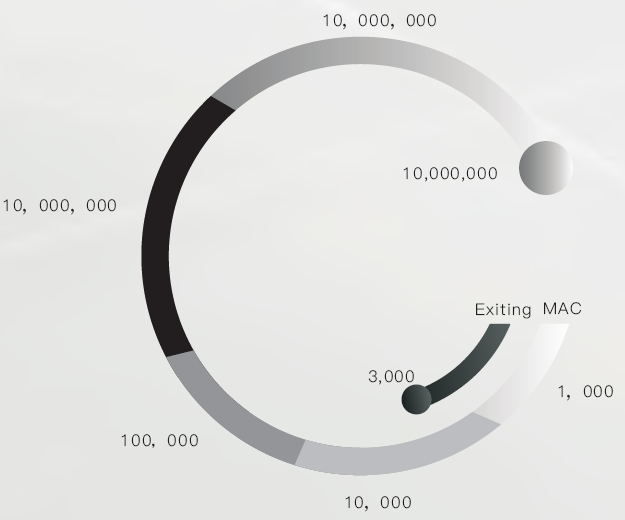
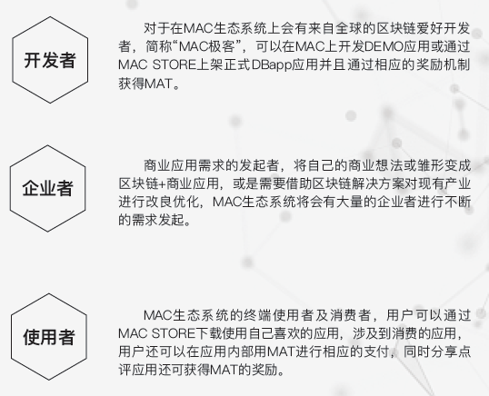

## 一、去中心化商业级应用（DBAPP）

&emsp;&emsp;去中心化交易平台等众多去中心化的应用底层开发，利用多原链的底层技术，进行去中心化平台的开发，对于去中心化的应用最主要的问题就是关于性能的问题，通过MAC多原链高性能可以解决这一问题痛点，高TPS可以解决诸如金融物流溯源等产业的需求，真正的实现商业级的应用，让区块链真正的进入3.0的时代，MAC多原链让区块链去中心化的技术从技术理论层面到实际应用层面，商业应用是对技术性能的最大考核标准，目前我们已经拥有了一些应用开发商基于多原链进行应用，未来我们还将会接入更多的应用，从全生态的产业链开始，进行全产业链的底层搭建开发，目前的区块链2.0时代都停留在发TOKEN开发钱包等简单的应用，无法真正的接入实体经济的应用，例如金融/物流/溯源/电商/支付/社交/生产流水线等众多实体企业，原因重点就在于商业化应用对区块链的性能开发是很重要的，多原链具备商业应用开发的素质。

&emsp;&emsp;有人说TPS不能作为区块链发坚信区块链作为一种技术必须还是要落实到实际应用中，那这其中就包含了大量的商业应用，作为商业层面的应用，无论 是溯源还是物流追踪还是支付，对TPS都有或多或少的要求，起码TPS理论也要在5000以上，而现有的共识机制不论是POW（TPS停留在个位数只能挖矿）还是POS(只能做简单的钱包和应用开发）乃至于是DPOS其实真正的做到TPS的突破都是不现实的，因为无法满足在高并发时的并发问题，从而使得在多用户多节点的时候出现TPS无法支撑的情况，即便是满足图灵完备的PBFT容错率高达33%所出现的TPS值也远远无法达到商业级别的应用，与传统VISA的TPS值相差甚远。

&emsp;&emsp;综上所述，MAC团队跳出了传统的区块链思维，我们突破了传统的共识机制思维，传统思维是共 识机制决定TPS从而决定Performance, 多原链MAC在底层的突破打破了传统思维，以算法为核心突破口，而用共识机制做相应的配合，从而达到了显著的效果和TPS的实测数据，所以我们多原链的重点是在于运算算法的核心部分，在这一层面，我们做了大量的工作和创新并取得了显著的成绩，通过多次运算及权威的超算中心测试，我们的TPS值实测突破了千万级别，这对于传统高性能开发平台开发不论是基于共识机制还是DAG都是极其深远的影响，未来多原链将会成为真正落地的商业应用链，满足金融/支付/电商/溯源/物流及更多产业的实体应用，切实的将区块链的技术以高性能的呈现运用在实体的各个领域中，真正的解决了现有去中心化无法做的高吞吐量痛点，极其方便的友好打造世界级区块链基础设施。

## 二、MAC底层开发生态社区

&emsp;&emsp;MAC底层开发生态社区分为以下三个主要板块：

&emsp;&emsp;MAC作为一种全生态底层开发平台，不仅仅是公链及联盟链的开发，而是包罗万象的一个MAC新次元空间，在MAC的新次元空间里，用户/开发/企业形成了三位一体的生态闭环，同时配合MAC强大的公链及联盟链底层技术支撑，使这个新次元空间拥有了集社交/金融/全产业解决方案的一整套产业化区块链开发领域，未来MAC将不断丰富生态社区，打造一个区块链3.0跨时代的MAC新次元空间。

## 三、概念定义

### 3.1 MAT通证/ MAT COIN
&emsp;&emsp;开发社区奖励令牌，长线价值投资TOEKN。

&emsp;&emsp;MAT Coin是一种基于MAC公有链搭载的Token通证，是一种随市场自由涨跌的公有链代币， 简称MAT（ Mac ApplicationToken）在上交易市场的情况下，通过MAT市场实时的流通量和交 易市场MAT的价格和来实时反映MAT生态系统的总体市值。同时MAT也作为生态社区的价值奖励TOKEN及部分DBapp的内置消费通证。

### 3.2 MAC系统/MAC OS
&emsp;&emsp;DBAPP开发应用平台，公链底层开发平台。

&emsp;&emsp;MAC OS生态操作系统，其中包含了MACSTORE应用商城，MAC公链联盟链底层开发，MAC　EXCHANGE交易系统， MAC WALLET钱包， MAC　MAIL加密社交。

&emsp;&emsp;MAC生态系统中的核心应用包括社交/金融/支付/物流等全产业链的区块链应用+开发，同时会针对于数据上链/云端数据/溯源等产业提供MAC区块链解决方案。

### 3.3 MAC社区/开发社区
&emsp;&emsp;开发者论坛及社区中心，—开发者、企业者、使用者三位一体生态闭环。

&emsp;&emsp;MAC开发者可以在论坛中进行沟通交流并随时编程开源及查阅相关的开发资料，同时MAC官方会定期的举办开发者大赛以及线下沙龙，并通过MAT进行相应的奖励；

&emsp;&emsp;同时，作为使用应用的B端企业将需要支付MAT进行版权购买使用，用户根据自己的注册时间对应用进行下载并通过MAT支付，在这种社区机制里，形成了开发者、企业者、使用者三位一体生态闭环。

&emsp;&emsp;如图所示，我们将开发者、企业者、终端用户通过三个维度的链接形成了三位一体的生态闭环，且皆通过MAC生态开发平台进行相应的开发及建设，在MAC生态平台中有自有的社交以及金融体系，即MAC加密邮箱及MAC钱包，通过MAC区块浏览器进行MAC应用商店的部署，Developer、Company、User可以通过MAT支付令牌进行相应的购买及奖励，在这个生态底层提供了集监管、投资、运营、开发多维一体的生态保障及机制。