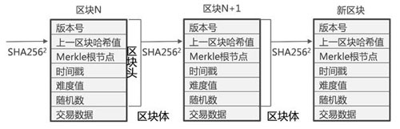

## 一、区块链的发展现状
从2008年中本聪发布比特币白皮书开始，区块链正式进入这个世界。到现在整整10年时间，区块链经历了币圈的疯狂和链圈的稳步发展。
但是，仍然有绝大多数人不了解区块链，甚至是参与炒币的一些人都不知道区块链的本质是什么。下面我们从最朴实的方式去学习了解什么是区块链。

## 二、区块链的本质
区块链是什么？一句话，它是一种特殊的分布式账本。

首先，区块链的主要作用是储存信息。任何需要保存的信息，都可以写入区块链，也可以从里面读取。

其次，任何人都可以架设服务器，加入区块链网络，成为一个节点。区块链的世界里面，没有中心节点，每个节点都是平等的，都保存着整个数据库。你可以向任何一个节点，写入/读取数据，因为所有节点最后都会同步，保证区块链一致。

## 三、区块链的样子
为什么叫区块链这个名字，接触过编程的人员应该能想象到。区块链就是由区块组成的链条。就像下图一样，每个区块连接着上一个区块，组成一条锁链。

然而每个区块里面包含区块头和区块体。区块头存储着哈希值，上一区块的哈希值，时间戳等。区块体则存储着众多的交易数据。详细刨开来看就是下面这个样子。

然后每个服务器上都会存储这样的区块链条，组成下面这个样子。

## 四、区块链的优点
到这里能想象到什么？是不是数据没有一个中心存储对象，安全性得到大大的提升，不会因为一台服务器毁坏而造成数据丢失。并且数据也不会被篡改，改掉一个服务器上的数据不会造成影响（除非改掉51%以上的服务器数据，不过那几乎是不可能的）。

所以总结区块链的优点有以下几个方面

**1、去中心化**

由于使用分布式核算和存储，不存在中心化的硬件或管理机构，任意节点的权利和义务都是均等的，系统中的数据块由整个系统中具有维护功能的节点来共同维护。

**2、开放性**

系统是开放的，除了交易各方的私有信息被加密外，区块链的数据对所有人公开，任何人都可以通过公开的接口查询区块链数据和开发相关应用，因此整个系统信息高度透明。

**3、自治性**

区块链采用基于协商一致的规范和协议(比如一套公开透明的算法)使得整个系统中的所有节点能够在去信任的环境自由安全的交换数据，使得对“人”的信任改成了对机器的信任，任何人为的干预不起作用。

**4、信息不可篡改**

一旦信息经过验证并添加至区块链，就会永久的存储起来，除非能够同时控制住系统中超过51%的节点，否则单个节点上对数据库的修改是无效的，因此区块链的数据稳定性和可靠性极高。

**5、匿名性**

由于节点之间的交换遵循固定的算法，其数据交互是无需信任的(区块链中的程序规则会自行判断活动是否有效)，因此交易对手无须通过公开身份的方式让对方自己产生信任，对信用的累积非常有帮助。

## 四、区块链的缺点
只要有优点就有缺点，区块链的缺点同样明显。

**1.不可篡改、撤销**

这个既是优点也是缺点，在区块链里没有后悔药，你对区块链的数据变动几乎无能为力，主要体现在：如果转账地址填错，会直接造成永久损失且无法撤销；如果丢失密钥也一样会造成永久损失无法挽回。而现实中如果你银行卡丢了或者密码忘记了，还能到银行营业点处理，你的钱还在。

**2.交易账本必须公开**

区块链是分布式，在公有链上，等于每个人手上都有一份完整账本，并且由于区块链计算余额、验证交易有效性等等都需要追溯每一笔账，因此交易数据都是公开透明的，如果我知道某个人的账户，我就能知道他的所有财富和每一笔交易，没有隐私可言。

**3.当数据越大伴随的性能问题**

就像前面说的，每个人都有一份完整账本，并且有时需要追溯每一笔记录，因此随着时间推进，交易数据超大的时候，就会有性能问题，如第一次使用需要下载历史上所有交易记录才能正常工作，每次交易为了验证你确实拥有足够的钱而需要追溯历史每一笔交易来计算余额。虽然可以通过一些技术手段（如索引）来缓解性能问题，但问题还是明显存在的。

**4.区块链的延迟性**

区块链的交易是存在延迟性的，拿比特币举例，当前产生的交易的有效性受网络传输影响，因为要被网络上大多数节点得知这笔交易，还要等到下一个记账周期（比特币控制在10分钟左右），也就是要被大多数节点认可这笔交易。还受一个小概率事件影响，就是当网络上同时有2个或以上节点竞争到记账权力，那么在网络中就会产生2个或以上的区块链分支，这时候到底那个分支记录的数据是有效的，则要再等下一个记账周期，最终由最长的区块链分支来决定。因此区块链的交易数据是有延迟性的。

## 五、MAC多元链简介
Multiple Atomic Chain，简称MAC，全球第一公链，以超千万级TPS为特点。是支持多个行业领域去中心化的场景应用商业开发的底层生态平台。

MAC多原链技术团队与多个高校和省级超级计算中心合作，对主网进行重新排列和测试，实验速度超过了1000万TPS，超过了全球所有目前已发布的实验速度数据。 公测版本已经对普通用户开放，MAC提供了不同的GUI版本，包括Linux，Windows和OS，以方便用户测试体验。

也就是说MAC是未来打造商用的一条公链，核心特点就是每秒的交易速度TPS，达到了千万级别。