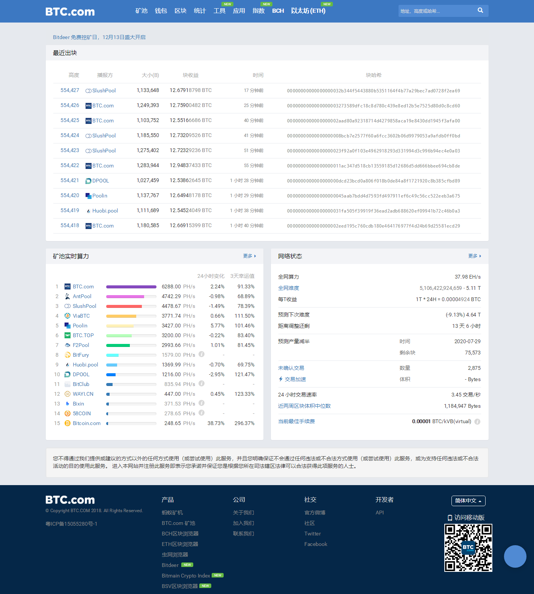
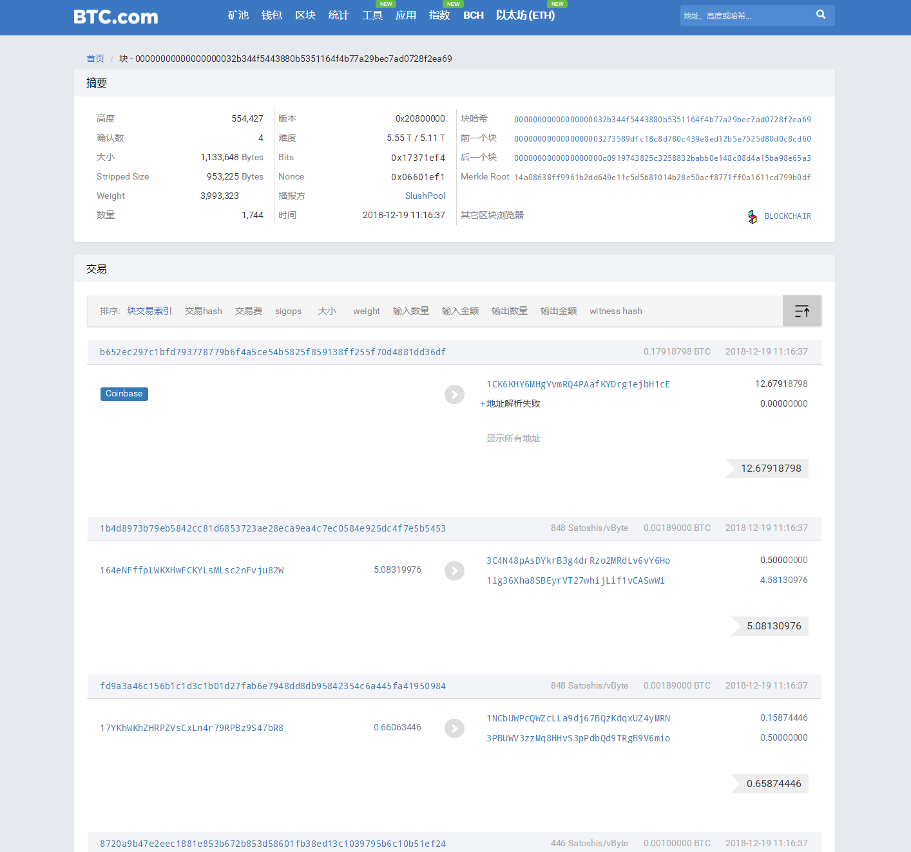

## 一、什么是激励机制

让别人干活，必须得付出酬劳。区块链的世界也同理，节点通过共识机制来创造新的区块，哪个节点创造出来，该节点就会得到Token（虚拟货币）。

所以每个在区块链上活跃的节点都在通过挖矿的方式来获取Token，比如比特币是通过算力，谁先算出这个hash的结果，谁得到奖励，以太坊则是通过一定的行为来触发，你触发次数越多，权益就越高，收获的奖励也就越多。这个奖励机制太聪明了，它让无数人前赴后继往里冲。奖励机制是区块链最伟大的发明。

简单来说，激励机制是通过经济平衡的手段，鼓励节点参与到维护区块链系统安全运行中来，防止对总帐本进行篡改、是长期维持区块链网络运行的动力。

## 二、发行机制

每个币种的发行机制是不同的。

以比特币为例：

1.比特币的总量为2100万个。

2.大概每10分钟生成一个区块，每个区块的生成伴随着比特币奖励的生成。

3.每满21万个区块，伴随区块生成的比特币奖励就减半一次。（因此通过挖矿获得比特币越来越难）。

## 三、区块链浏览器

区块链浏览器是浏览区块链信息的主要窗口，每一个区块所记载的内容都可以从区块链浏览器上进行查阅。

我们以btc.com网站为例，打开后网站分为三大板块：

* 最近出块：可以看到当前比特币的最新区块高度是多少，之前经常有团队说在比特币某某区块高度的时候分叉一个新的币，就可以查看这个来估计分叉时间。

* 矿池算力：可以当前各大矿池的算力数据

* 网络状态：在转账的时候最需要关注这个版块的两个字段是：

> 1.未确认交易：如果未确认数量很大，在转账的时候肯定会很慢，要做好心理准备。

> 2.当前最佳手续费：如果转账着急就可以参考这个数值来填写矿工费来让交易的时间不要太长

* 区块高度：
比特币是基于区块链技术的应用，而区块链之所以叫区块链，就是一个新区块连接到旧的区块上，块高度表示这个新的区块是这条区块链的第几个区块。比如说图中这个最新的块，高度为522,593，就表示它是比特币区块链上的第522,593个区块。

* 区块内容：
区块里包含的信息有**区块头**和**区块体**。也就是对于的下图的**摘要**和**交易**。

## 四、如何查看自己的交易信息？

可以在搜索框中输入区块地址、区块高度、哈希来进行搜索，查看交易信息。

## 五、出块流程

1. 产生一笔新交易

   一笔新交易产生时，会先被广播到区块链网络中的其它参与节点。
   
2. 各节点将数笔新交易放进区块

   每个节点会将数笔未验证的交易Hash值收集到区块中，每个区块根据区块大小可以包含数百笔或上千笔交易，并且每一笔交易都会支付gas来作为手续费，谁出的手续费越高，谁就会最先被放进区块。
   
3. 决定由谁来验证这些交易

   各节点进行工作量证明的计算来决定谁可以验证交易，由最快算出结果的节点来验证交易，这就是取得共识的做法。

4. 取得验证权的节点将区块广播给所有节点

   最快完成POW的节点，会将自己的区块广播给其他节点
   
5. 各节点验证并接上新区块

   其他节点会确认这个区块所包含的交易是否有效，确认没被重复花费且具有效数位签章后，接受该区块，此时区块才正式接上区块链，无法再窜改资料。

6. 交易验证完成

   所有节点一旦接受该区块后，先前没算完POW工作的区块会失效，各节点会重新建立一个区块，继续下一回POW计算工作。

## 五、MAC的发行机制

暂时保密，主网上线后公布，尽情期待！