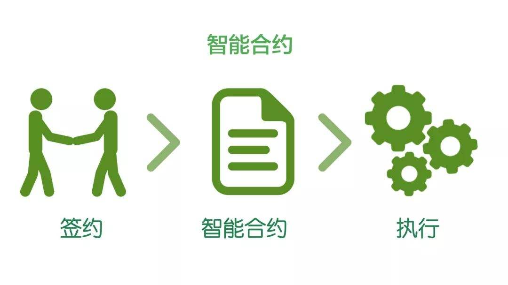
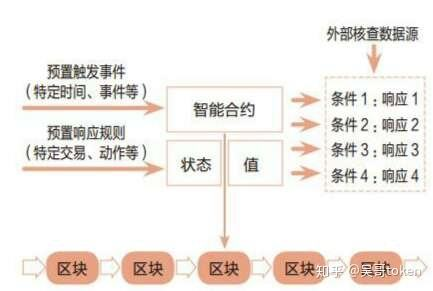

## 一、智能合约的成长背景

谈到区块链，以太坊必定离不开‘智能合约’(Smart contract)这个词。智能合约是90年代就提被提出来的一个词，而限于当时的种种问题，智能合约还不足以获得成长。类似于更早就提出的‘人工智能’的概念。同样是限于当年的计算能力，数据资源等等原因不足以得到发展。

## 二、一个例子

我们从一个简单的合约的例子来看。例如A公司与B公司签订的买卖合同，如果A公司到账后,那么B公司则在一定的时间内应当赋予A公司一定的物资。如果A公司在付款之后，B公司拒不履行合同。或者其他的理由延迟发货期限。那么可能给A公司造成巨大的损失。在现实情况下，可能A公司只能去法院起诉B公司。而这个周期又包含了起诉,立案,宣判,执行阶段。而这个延迟的周期又是被拉长了。A公司甚至可能因此而破产（笔者记得在哪里读过这类的案例）。

也就是说传统的合约，合同可能执行起来会遇到很多的问题。执行失效问题、第三方参与问题。甚至在合约执行的过程中可能遇到更多的其他问题（笔者是个开发者对于合同相关的东西了解的不多）。

## 三、智能合约的定义

‘智能合约是一套以数字形式定义的承诺，包括合约参与方可以在上面执行这些承诺的协议’也就是说智能合约是一套能够自动执行某些手动才能完成任务的协议。其实智能合约相当于在计算机系统中构建一份参与方均可读的合同。只有当某一事件触发后，则会立即执行。例如，A向B付款**元，B则给予A货物。

## 四、区块链解决了‘智能合约’的信任问题。

智能合约并不是一定要依赖于区块链来实现，而区块链的部分基础特性决定了智能合约更加适合于在区块链上来实现。比如去中心化，数据的防篡改，高可用性等。去中心化能够保证数据的全网备份与不可受第三方机构的干扰，无需担心数据会被篡改。同时也立于以后的审计工作。高可用性不会存在如目前的中心服务或者中心存储系统受到攻击或其他问题而发生合约不执行的问题。其实综合来说,区块链给予智能合约最好的特性就是“信任机制”

‘智能合约’的出现可能对商业会进行一个大的颠覆。例如之前的商业合作需要第三方公信机构的参与或者需要第三方的担保。而基于区块链‘智能合约’的出现大大减少了人工的参与。如担保，审计，核验等等。

当然目前来说‘智能合约’同样也有很多的局限性。例如线下的问题解决起来还是无法与线上的问题相提并论的。如商品问题，给予的商品质量如何评估与上链，是否还需要依赖于第三方？ 同时智能合约的编写者对于合约的细节把控必须特别的严谨。一是合约漏洞，不严谨的合约造成对某个参与者的损失。二是可能会出现Bug，而如果bug被黑客所利用那么就会造成重大的损失。同样智能合约的法律问题也是要考虑的重点。

总体而言智能合约还是能够解决目前我们很多的问题，替代大部分的人工劳动力解决常见问题等。

## 五、以太坊的智能合约

为什么以太坊是区块链2.0的时代，最大的原因就是以太坊带来了智能合约。用户可以发布自定义的合约来做任意想做的事。

然而做的最多的事情就是代币发行，市面上绝大多数币种都是基于以太坊发行的代币，没有任何价值支撑，所以任何机构包括个人都可以很简单的发币。然而发币如果没有对应的实体支撑的话，这种代币则被称为空气币，因为他们一分不值。所以如果要投资数字货币请擦亮自己的眼睛。

我们后续会讲到如何基于以太坊发币。

## 六、MAC的智能合约

暂时保密，主网上线后公布，尽情期待！