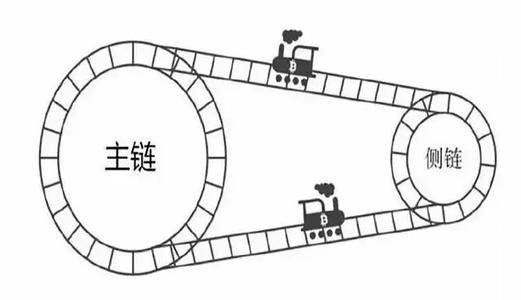
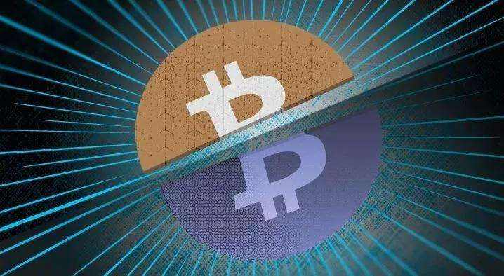
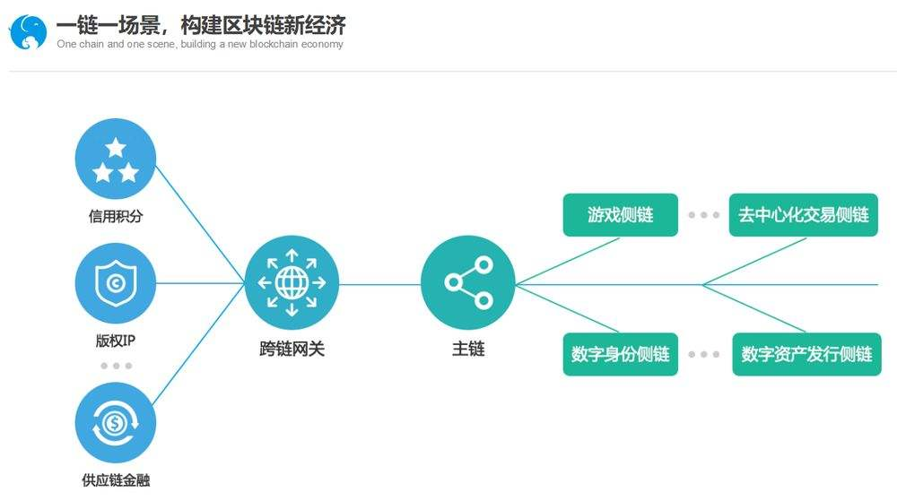
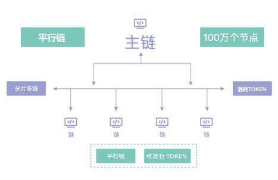

## 一、什么是侧链和主链？

**主链**：即正式上线的、独立的区块链网络。可以这样说，区块链的存储数据的实体，一般认为是主链网络本身。比如BTC主网、ETH主网和即将上线的EOS主网都是主链。

**侧链**：首先，侧链协议的本质属于一种跨区块链的解决方案。简单的说,通过此方案可以让数据信息在两条区块链之间实现转移。侧链最初的提出是基于实现比特币和其他数字资产在多个区块链间的转移。

通俗来说，侧链就像是一条条通路，将不同的区块链互相连接在一起，以实现区块链的扩展。侧链完全独立于主链，但是这两个账本之间能够“互相操作”，实现交互。

## 二、分叉不是侧链

和侧链概念同时提及比较多的一个是**分叉**，这又是什么呢？

比如有人恶意对比特币网络发动攻击，比如矿工没有及时升级软件，比如不同开发者对比特币网络的发展产生不同意见等，这些时候都可能出现分歧，导致分裂出不同的链，这种情况就是我们常说的比特币分叉。显然分叉和侧链是完全不一样的。

比如近期的BCH分叉，由于对公链的方向认定不同，两大开发团队对BCH公链实施硬分叉，分成了BCHABC和BCHSV两条公链。分叉实际上就类似于细胞分裂，分裂后的两个个体分别独立了。

## 三、侧链技术带来的意义

1. 主链上面很多无法实现的功能，可以通过侧链得到补充和完善。通过侧链，可以轻松创建明智的合约股票，期货等衍生品; 主链只有唯一，但是侧链可以成千上万，所有侧链都可以有不同的用途，具有不同的功能，这就为区块链世界打开了可能的大门。

2. 规避主链的较大安全隐患。因为侧链可以更改方式来升级协议，或者它可以作为一种安全的防火墙，这样当一个侧链发生灾难性的问题时，主链就不会受到影响。

目前，包括RSK、Mimblewimble、Bitcoin Hivemind等在内的平台都在致力于侧链的开发，同时越来越多的平台正在加入侧链的研发行列。

## 四、平行链技术

平行链代码和主链相同，使用相同的共识算法，由于平行链本是独立的区块链，有自己的节点网络，代码以及数据也是相对独立的，所以它在运行过程中不会增加主链的负担，避免数据过度膨胀的情况出现。

主链与平行链之间是互惠互利的关系，主链为平行链提供基础设施，如数据库写入、网络通讯、加密等，平行链则可以为主链补充更多的节点，以壮大整个系统。如果平行链能够吸引到足够的节点，反而会反哺主链，让主链变得更安全，主链和平行链之间通过价值互换通道完成消息传递和价值转移。

## 五、MAC的平行链和侧链技术

暂时保密，主网上线后公布，尽情期待！