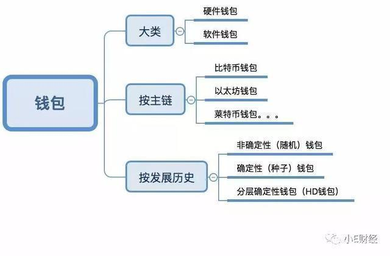

## 一、什么是区块链钱包

结论：
1. 钱包就是保存区块链各种币（比特币、以太币等）的一个软件
2. 密钥和地址就是区块链世界里的银行卡号和密码
3. 钱包本质是保存密钥，也就是保存银行卡和密码
4. 为什么需要钱包保存密码？不像银行卡密码，区块链币的密码是一串长达256位，无任何含义的二进制数字。

## 二、钱包基础功能

## 三、钱包基础功能钱包分类

钱包大致可以按照大类、主链类别、发展历史分类，具体如下：

拿硬件钱包举个例子，看下图国产的某钱包，就是纯硬件保存私钥的：

## 四、以太坊（ETH）钱包「地址、密码、私钥、助记词、Keystore 」

以太坊系钱包有几个名词必须深刻理解，不然就有可能造成区块链资产的损失，这几个名词为地址、密码、私钥、助记词、keystore。

若以银行账户为类比，这 5 个词分别对应内容如下：

* 地址=银行卡号
* 密码=银行卡密码
* 私钥=银行卡号+银行卡密码
* 助记词=银行卡号+银行卡密码
* Keystore+密码=银行卡号+银行卡密码
* Keystore ≠ 银行卡号

一、地址

地址=银行卡号

1.生成

创建钱包后会生成一个以 0x 开头的 42 位字符串，这个字符串就是钱包地址，一个钱包对应一个钱包地址，地址唯一且不能修改，也就是说一个钱包中所有代币的转账收款地址都是一样的。例如，一个钱包中 ETH 的转账收款地址和 EOS 的转账收款地址是一样。这一点和交易平台上的不一样，平台上不同代币的转账收款地址一般都不同，因此，转币到交易平台前一定要确认好地址。

2.用途

钱包地址可以用于接收别人转币，也可以作为转币的凭证。

二、密码

密码=银行卡密码

1.设定

在创建钱包时，需要设定一个密码，这个密码要求不少于 8 个字符，为了安全，密码最好设置复杂一点。密码可以进行修改或重置，修改密码有两种方法，一是直接修改密码，这需要输入原密码。如果原密码忘记了，用助记词或私钥导入钱包，同时设置新密码。

2.用途

密码的用途有两个，一是转账时候的支付密码，二是用 keystore 导入钱包时的登录密码。

3.特征

在现实世界中，一个银行卡只对应一个密码，对密码修改后，原密码就失去作用。但是在 imToken 钱包中，就不一样了，一个钱包在不同手机上可以用不同的密码，彼此相互独立，互不影响。例如，在 A 手机钱包中设置了一个密码，在 B 手机导入这个钱包并设置一个新密码，并不影响 A 手机钱包的密码使用。

三、私钥

私钥=银行卡号+银行卡密码

1.导出

创建钱包后，输入密码可以导出私钥，这个私钥属于明文私钥，由 64 位字符串组成，一个钱包只有一个私钥且不能修改。

2.用途

在导入钱包中，输入私钥并设置一个密码（不用输入原密码），就能进入钱包并拥有这个钱包的掌控权，就可以把钱包中的代币转移走。

四、助记词

助记词=银行卡号+银行卡密码

助记词=私钥

1.备份

创建钱包后，会出现一个备份助记词功能，选择备份助记词，输入密码，会出现 12 个单词，每个单词之间有一个空格，这个就是助记词，一个钱包只有一个助记词且不能修改。

2.用途

助记词是私钥的另一种表现形式，具有和私钥同样的功能，在导入钱包中，输入助记词并设置一个密码（不用输入原密码），就能进入钱包并拥有这个钱包的掌控权，就可以把钱包中的代币转移走。

3.特征

助记词只能备份一次，备份后，在钱包中再也不会显示，因此在备份时一定要抄写下来。

五、keystore

keystore+密码=银行卡号+银行卡密码

Keystore ≠ 银行卡号

keystore=加密私钥

keystore+密码=私钥

1.备份

钱包里有一个备份 keystore 功能，选择备份 keystore，输入密码，会出现一大段字符，这个就是 keystore。

2.用途

在导入钱包中，选择官方钱包，输入 keystore 和密码，就能进入钱包了。需要说明的是，这个密码是本手机原来设置的本钱包密码， 这一点和用私钥或助记词导入钱包不一样，用私钥或助记词导入钱包，不需要知道原密码，直接重置密码。

3.特征

keystore 属于加密私钥，和钱包密码有很大关联，钱包密码修改后，keystore 也就相应变化，在用 keystore 导入钱包时，需要输入密码，这个密码是备份 keystore 时的钱包密码，与后来密码的修改无关。

六、结语

在现实世界中，如果你的银行卡丢了，密码忘了，可以去银行帮你找回，你的钱还是你的钱，丢不了，这是中心化的优势。

但是在区块链世界中，除了你自己，没有人存储你的钱包信息，钱包信息要是丢了，没人能够帮你找回，钱包公司也不能。因此，只要你保护好钱包信息，钱包里面的财产只属于你自己，谁也抢不走，这是去中心化的优势。

1.忘记

你若把钱包信息忘了，会有什么后果呢？分这么几种情况：

（1）地址忘了，可以用私钥、助记词、keystore+密码，导入钱包找回。

（2）密码忘了，可以用私钥、助记词，导入钱包重置密码。

（3）密码忘了，私钥、助记词又没有备份，就无法重置密码，就不能对代币进行转账，等于失去了对钱包的控制权。

（4）密码忘了，keystore 就失去了作用。

（5）私钥忘了，只要你钱包没有删除，并且密码没忘，可以导出私钥。

可以用助记词、

（7）助记词忘了，可以通过私钥、keystore+密码，导入钱包重新备份助记词。

（8）keystore 忘了，只要你钱包没有删除，密码没忘，可以重新备份keystore。

助记词，

从上可以看出，只要「私钥、助记词、Keystore+密码」有一个信息在，钱包就在。因此，备份好「私钥、助记词、Keystore+密码」最关键。

2.泄露

自己备份好钱包信息很重要，同时防止钱包信息泄漏，也很重要。若把钱包信息泄漏出去了，会有什么后果呢？分这么几种情况：

（1）地址泄漏了，没有关系。

（2）密码泄漏了，没有关系。

（3）地址+密码泄漏了，只要手机不丢，也没有关系。

泄漏了，密码没有泄漏，没有关系。

（5）keystore+密码

泄漏了，别人就能进入钱包，把币转走。

泄漏了，别人就能进入钱包，把币转走。

从上可以看出，只要「私钥、助记词、Keystore+密码」有一个信息泄漏出去，别人就拥有了你钱包的控制权，你钱包中的币就会被别人转移走。因此，「私钥、助记词、Keystore+密码」绝不能泄漏出去，一旦发现有泄漏的可能，就要立刻把里面的币转移走。

3.备份

既然私钥、助记词、Keystore+密码」如此重要，那么如何进行保存呢，最安全的方法就是：

手抄纸上
由于 Keystore 内容较多，手抄不方便，保存在电脑上也不安全，因此可以不对 Keystore 进行备份，只手抄私钥、助记词就足够了，手抄备份要注意以下几点：

（1）多抄几份，分别放在不同的安全区域，并告诉家人。

（2）对手抄内容进行验证，导入钱包看能不能成功，防止抄写错误。

（3）备份信息不要在联网设备上进行传播，包括邮箱、QQ、微信等。

（4）教会家人操作钱包。​​​​

## 六、MAC钱包

暂时保密，主网上线后公布，尽情期待！