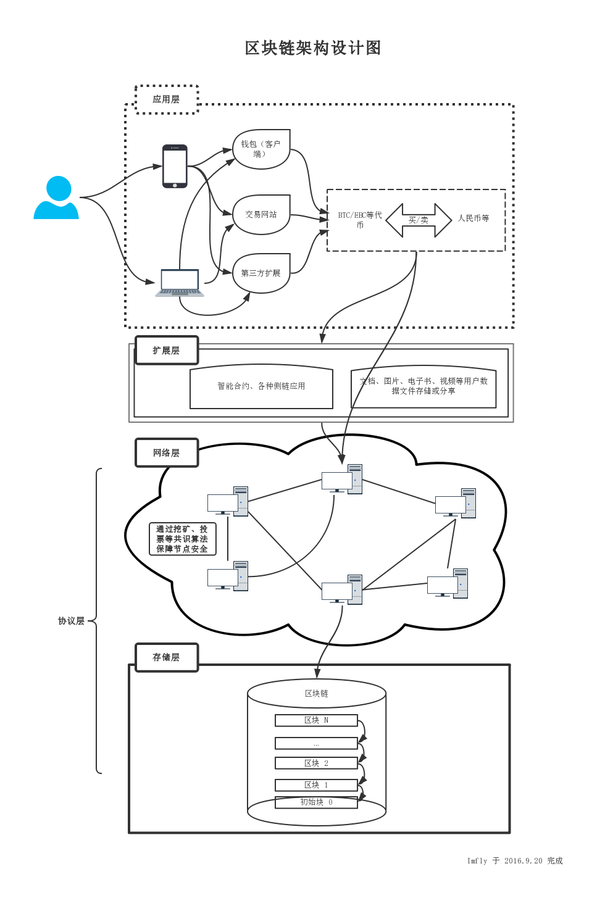
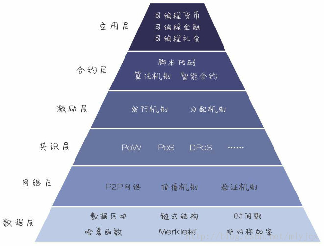

## 一、前言

区块链本身不是新技术，可以说它是一种技术架构。无论你擅长什么编程语言，都能够参考这种设计去实现一款区块链产品。

我们的课程也是按照区块链的技术架构，从底层数据层慢慢讲起，讲到上层的应用。

## 二、架构图

从架构设计上来说，区块链可以简单的分为三个层次，协议层、扩展层和应用层。其中，协议层又可以分为存储层和网络层，它们相互独立但又不可分割。如图：

## 三、协议层

所谓的协议层，就是指代最底层的技术。这个层次通常是一个完整的区块链产品，类似于我们电脑的操作系统，它维护着网络节点，仅提供Api供调用。通常官方会提供简单的客户端（通称为钱包），这个客户端钱包功能也很简单，只能建立地址、验证签名、转账支付、查看余额等。这个层次是一切的基础，构建了网络环境、搭建了交易通道、制定了节点奖励规则，至于你要交易什么，想干什么，它一概不过问，也过问不了。典型的例子，自然是比特币，还有各种二代币，比如莱特币等。这个层次，是现阶段开发者聚集的地方，这说明加密货币仍在起步当中。

从用到的技术来说，协议层主要包括**网络编程**、**分布式算法**、**加密签名**、**数据存储技术**等4个方面，其中网络编程能力是大家选择编程语言的主要考虑因素，因为分布式算法基本上属于业务逻辑上的实现，什么语言都可以做到，加密签名技术是直接简单的使用（请看书中相关的加密解密文章，不建议自由发挥，没有过多的编码逻辑），数据库技术也主要在使用层面，只有点对点网络的实现和并发处理才是开发的难点，所以对于那些网络编程能力强，对并发处理简单的语言，人们就特别偏爱。也因此，Nodejs开发区块链应用，逐渐变得更加流行，Go语言也在逐渐兴起。

上面的架构设计图里，我把这个层面进一步分成了**存储层**和**网络层**。数据存储可以相对独立，选择自由度大一些，可以单独来讨论。选择的原则无非是性能和易用性。我们知道，系统的整体性能，主要取决于网络或数据存储的I/O性能，网络I/O优化空间不大，但是本地数据存储的I/O是可以优化的。比如，比特币选择的是谷歌的LevelDB，据说这个数据库读写性能很好，但是很多功能需要开发者自己实现。目前，困扰业界的一个重大问题是，加密货币交易处理量远不如现在中心化的支付系统（银行等），除了I/O，需要全方位的突破。

分布式算法、加密签名等都要在实现点对点网络的过程中加以使用，所以自然是网络层的事情，也是编码的重点和难点。当然，也有把点对点网络的实现单独分开的，把节点查找、数据传输和验证等逻辑独立出来，而把共识算法、加密签名、数据存储等操作放在一起组成核心层。无论怎么组合，这两个部分都是最核心、最底层的部分，都是协议层的内容。

## 四、扩展层

这个层面类似于电脑的驱动程序，是为了让区块链产品更加实用。目前有两类，一是各类交易市场，是法币兑换加密货币的重要渠道，实现简单，来钱快，成本低，但风险也大。二是针对某个方向的扩展实现，比如基于MAC侧链，可为第三方出版机构、论坛网站等内容生产商提供定制服务等。特别值得一提的就是大家听得最多的“智能合约”的概念，这是典型的扩展层面的应用开发。所谓“智能合约”就是“可编程合约”，或者叫做“合约智能化”，其中的“智能”是执行上的智能，也就是说达到某个条件，合约自动执行，比如自动转移证券、自动付款等，目前还没有比较成型的产品，但不可否认，这将是区块链技术重要的发展方向。

扩展层使用的技术就没有什么限制了，可以包括很多，上面提到的分布式存储、机器学习、VR、物联网、大数据等等，都可以使用。编程语言的选择上，可以更加自由，因为可以与协议层完全分离，编程语言也可以与协议层使用的开发语言不相同。在开发上，除了在交易时与协议层进行交互之外，其他时候尽量不要与协议层的开发混在一起。这个层面与应用层更加接近，也可以理解为B/S架构的产品中的服务端（Server）。这样不仅在架构设计上更加科学，让区块链数据更小，网络更独立，同时也可以保证扩展层开发不受约束。

从这个层面来看，区块链可以架构开发任何类型的产品，不仅仅是用在金融行业。在未来，随着底层协议的更加完善，任何需要第三方支付的产品都可以方便的使用区块链技术；任何需要确权、征信和追溯的信息，都可以借助区块链来实现。我个人觉得，这个目标应该很快就能实现。

## 五、应用层

这个层面类似于电脑中的各种软件程序，是普通人可以真正直接使用的产品，也可以理解为B/S架构的产品中的浏览器端（Browser）。这个层面的应用，目前几乎是空白。市场亟待出现这样的应用，引爆市场，形成真正的扩张之势，让区块链技术快速走进寻常百姓，服务于大众。大家使用的各类轻钱包（客户端），应该算作应用层最简单、最典型的应用。很快，MAC将基于自身主链推出生态系统，这个就是典型的应用层的产品。

## 六、编程实现

很多小伙伴，习惯结合自己的技术背景，来理解上面的架构设计。这里，结合具体的编程语言，简单介绍几款产品，仅供参考。

（1）C/C++

这两个语言是无法逾越的，任何开发遇到瓶颈，基本上都会找到它们，自然应该排在第一位要介绍的。同时，区块链技术的鼻祖，比特币（协议层）就是用C++语言开发的，而且目前为止，没有比比特币更加成功的区块链产品。所以，无论你使用什么语言开发，在正式进入这个行业的过程中，都应该先研究研究比特币。比特币官方客户端钱包用的Qt，第三方钱包有Python语言开发的，特别是第三方整理的开发库（Api包）很多是Nodejs设计的。比特币的架构，与上面的架构设计基本相同，另外，因为共识算法采用的是工作量证明机制（PoW:Proof of work)，还有一些特殊的挖矿的过程。其他竞争币都是直接来自比特币的分支，所以编程语言相同，具体的技术选型和技术实现上可能有所改进，比如：莱特币，使用了其他的加密算法。

官方网站：https://bitcoin.org/

源码库：https://github.com/bitcoin

（2）Nodejs/Javascript

Nodejs平台强大的网络编程能力，以及js脚本语言的简单快捷，在区块链领域自然少不了它的身影。

官方网站：http://ebookchain.org/

源码库：https://github.com/Ebookcoin

（3）Python

如果是Python语言爱好者，我建议研究研究以太坊（Ethereum）的Python实现。尽管因为The Dao事件闹得沸沸扬扬，但从技术实现的角度来说，仍然值得参考学习。以太坊官方定位为一种开发管理分布式应用的平台，主攻方向就是“智能合约”，并为其定制了一种编程语言Solidity。以太坊的核心是以太坊虚拟机（EVM），允许用户按照自己的意愿创建操作。以太坊给出了Go、Java、Python等多语言的实现。其中以python为基础的实现主要包括三个部分：Pyethapp是客户端部分；pyethereum是核心库，实现了区块链、以太坊模拟机和挖矿等功能；pydevp2p是点对点网络库，实现了节点发现、合约代码传输、加密签名等功能，这三者组合在一起就是完整的区块链实现，后面两个核心库共同组成了协议层。另外，go-ethereum是go语言的完整实现；Ethereum(J) 是纯Java实现，它作为可以嵌入任何Java/Scala项目的库提供。客户端方面，还有Rust、Ruby、Javascript等语言的实现。

官方网站：https://ethereum.org/

源码库：https://github.com/ethereum/pyethapp

（4）Go

在多核时代，Go语言备受喜爱，它可以让你用同步方式轻松实现高并发，特别是在分布式系统、网络编程等领域，应用非常广。所以，在区块链开发领域，也有很多使用Go语言的项目。其中，由linux基金会主导的超级账本（HyperLeger），版本库的名字叫Fabric，就是其中一个。该项目试图为新一代的事务应用创建一种开放的分布式账本标准，支持许可式区块链（这种方式可能无法再现比特币那种强大的网络效应）。Fabric的开发环境建立在VirtualBox虚拟机上，部署环境可以自建网络，也可以直接部署在BlueMix上，部署方式可docker化，支持用Go和JavaScript开发智能合约。它采用PBFT分布式算法，网络编程方面用gRPC来做P2P通讯，使用 Protocol Buffer来序列化要传递的数据结构。在架构设计上，Fabric可能与比特币等区块链产品有所不同，但是上述基本组成部分还是不可或缺的。

官方网站：https://www.hyperledger.org/

源码库：https://github.com/hyperledger

其他编程语言，比如：C#等，也有具体实例，这里就不再列举。总之，针对不同的编程语言，在具体的编码或架构设计上可能有所差别，甚至很大，但是协议层所使用的技术并没有太大的变化。其中，网络编程是重点和难点，多数没有现成的框架可用，都是使用编程语言自身提供的库来设计开发，所以比较底层，非常考验开发者的编码功底。

暂时保密，主网上线后公布，尽情期待！

## 七、另一版本的架构图

其实区块链的底层架构都差不多，也有按照下图进行分类的架构图，分的更精细了一些。

**1. 数据层-描述区块链技术的物理形式**

区块链系统设计的技术人员首先建立的一个起始节点是“创世区块”，之后在同样规则下创建的规格相同的区块通过一个链式的结构依次相连组成一条主链条。随着运行时间越来越长，新的区块通过验证后不断被添加到主链上，主链也会不断地延长。

**2. 网络层-实现区块链网络中节点之间的信息交流。**

区块链网络本质上是一个P2P（点对点）网络。每一个节点既接收信息，也产生信息。节点之间通过维护一个共同的区块 
链来保持通信。区块链的网络中，每一个节点都可以创造新的区块，在新区块被创造后会以广播的形式通知其他节点，其他节点会对这个区块进行验证，当全区块链网络中超过51%的用户验证通过后，这个新区块就可以被添加到主链上了。

**3. 共识层-让高度分散的节点在去中心化的系统中高效地针对区块数据的有效性达成共识。**

区块链中比较常用的共识机制主要有

工作量证明（Proof of Work）
权益证明（Proof of Stake）
股份授权证明（Delegated Proof of Stake）
还有投注共识、瑞波共识机制、Pool验证池、实用拜占庭容错、授权拜占庭容错、帕克索斯算法等。

**4. 激励层-提供一定的激励措施，鼓励节点参与区块链的安全验证工作。**

**5. 合约层-主要是指各种脚本代码、算法机制以及智能合约等。**

以比特币为例，比特币是一种可编程的货币，合约层封装的脚本中规定了比特币的交易方式和过程中涉及的种种细节。

**6. 应用层-封装了区块链的各种应用场景和案例**

比如基于区块链的跨境支付平台OKLink

## 八、MAC的技术架构

后续章节会进行详细讲解。