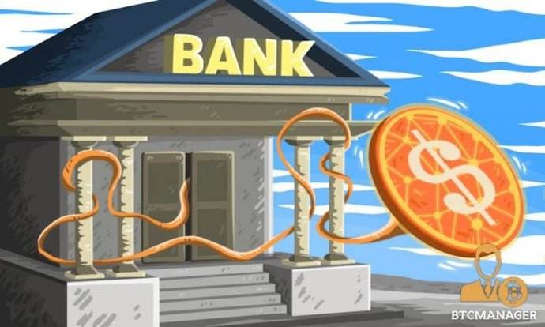

## 一、应用前提

从技术角度解释，区块链是分布式数据存储、点对点传输、共识机制、加密算法等计算机技术的新型应用模式。由此来看，能够影响未来世界的区块链应用项目，它们必须有以下几个共同特质：

1. 所在领域对数据安全需求极高
2. 所在领域对数据隐私要求极高
3. 运转计算过程需要可追溯、不可篡改
4. 可降低社会成本
5. 开放姿态，众人皆能贡献参与
6. 拥有自己独立发行的token令牌
7. 该行业在互联网格局中已高度繁荣

## 二、金融

区块链应用金融领域的核心价值：促进反洗钱和顾客身份审查。

在区块链的创新和应用探索中，金融是最主要的领域，区块链技术在数字货币、支付清算、智能合约、金融交易、物联网金融等多个方面存在广阔的应用前景。

支付环节需要可信任担保交易，如果有一个“可信任的超级系统”，让交易变得直观而安全，也就不需要第三方担保了，区块链的出现恰好可以让这个想法变成现实。

比特币是目前区块链技术最广泛、最成功的运用，因为其具有不可篡改的时间戳和全网公开的特性，得到了银行、证券、保险等金融行业的广泛信赖，近些年更是疯狂暴涨，甚至在许多国家比特币已经成为了合法货币。

## 三、游戏
区块链应用游戏领域的核心价值：把游戏权利交还给游戏玩家。

区块链技术去中心化、智能合约、资产交易等技术特点，能很好的解决目前游戏行业游戏数据和用户数据隐私泄漏的问题，促进游戏中虚拟数字货币的保值，实现用户与游戏开发平台公平的价值共享。

在国外，区块链技术已广泛应用在游戏货币支付环节，启动区块链支付网关，为游戏行业提供加密货币支付方案。

## 四、社交
区块链应用社交领域的核心价值：让用户自己控制数据，杜绝隐私泄露。

想想为什么我们刚刚浏览完某个购物网站，总会在其他社交平台上收到类似的广告弹窗，因为数据隐私被利用。

区块链技术在社交领域的应用目的，就是为了让社交网络的控制权从中心化的公司转向个人，实现中心化向去中心化的改变，让数据的控制权就牢牢掌握在用户自己手里。

借助匿名化的区块链网络及其内嵌代币机制，充分保证用户隐私安全，同时利用标签代币化和个性化定价，帮助人们重塑社交网络形象、人与人之间关系、身份与认知。

## 五、版权
区块链应用版权领域的核心价值：重塑对知识产权的保护。

区块链的技术将所有的交易都记录在区块中，且形成记录不可被篡改，因此所有交易都可以被追踪和查询到，保障了区块链上的交易透明性，避免网络中的用户非法使用具有知识产权保护的内容。对原创者来说，这是一种更便捷、更安全、更低廉的版权保护方式。

目前区块链技术多应用于数字音乐的版权保护，分散式帐簿和公平贸易音乐数据库，可以充分解决所有权，付款和透明度问题。

## 六、云计算
区块链应用云计算领域的核心价值：推动公共信任基础设施建设进程。

区块链与云的结合也是必然趋势，区块链与云的结合，有两种模式，一种是区块链在云上，一种是区块链在云里。后面一种，也就是BaaS，Blockchain-as-a-Service，是指在云服务商直接把区块链作为服务提供给用户。

未来，云服务企业越来越多地将区块链技术整合至云计算的生态环境中，通过提供BaaS功能，有效降低企业应用区块链的部署成本，降低创新创业的初始门槛。

## 七、共享经济
区块链应用共享经济领域的核心价值：为平台构建用户信任。

区块链是基于分布式和一致性的存储系统，实现对于P2P商业模式下透明真实的信用管理体系。核心是去中心化和去信任化，破解分享经济的信任痛点。P2P网贷、二手车交易、住宿分享等分享经济细分领域都已经开始尝试。

区块链通过借助智能合约技术、能够自动执行满足某项条件下的操作，也能够使得更多商品“共享”，大幅降低契约建立和执行的成本。

如果将智能合约运用于自行车租赁、房屋共享等领域，也许会给整个行业带来全新的改变。

## 八、数字广告
区块链应用数字广告领域的核心价值：实现广告投放精准化，保障用户隐私不受侵犯。

区块链技术在数据不可篡改，去中心化，安全方面的天然优势说明其与数字广告存在天然的嫁接优势。智能合约在打击数字广告欺诈的同时还能有效提升广告交易的效率。

采用去中心化的商业模式，不依赖任何中心化的中介机构，不依赖竞价排名的困扰，实现自由提交在线广告合约，投放效果完全不需要担心被任何环节篡改和被渠道方虚假投放问题。

用户把个性化元数据设置在自己的私有设备上，私密和敏感信息都只会保留在自己的设备上，一部分可以公开的用于合约撮合元数据才会被业务区块链同步，保护好每一个用户的隐私的同时，用户才可以在本地触发广告者广告播放合约，并从中获取一定的额外奖励。

## 九、MAC区块链应用

后续章节会进行详细讲解。