## 一、简介
**首先，学习本章之前，请确保你掌握了之前的课程，否则本章节你很难坚持到最后，祝你好运！！！**

不管你们知不知道以太坊（Ethereum blockchain）是什么，但是你们大概都听说过以太坊。但是如果你们对以太坊到底是什么没有一个基本的了解的话，看这些文章就会感觉跟看天书一样。 所以，什么是以太坊？本质上，就是一个保存数字交易永久记录的公共数据库。重要的是，这个数据库不需要任何中央权威机构来维持和保护它。相反的它以一个“无信任”的交易系统来运行—一个个体在不需要信任任何第三方或对方的情况下进行点对点交易的架构。

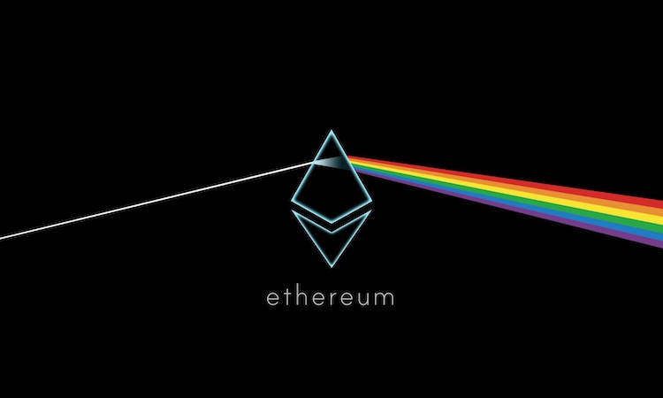

依然感到很困惑？这就是这篇文章存在的理由。我的目标是在技术层面来解释以太坊的工作原理，但是不会出现很复杂的数学问题或看起来很可怕的公式。即使你不是一个程序员，我希望你看完之后最起码对技术有个更好的认识。如果有些部分技术性太强不好理解，这是非常正常的，真的没有必要完全理解每一个小细节。我建议只要宏观的理解一下事物就行了。

这篇文章中的很多议点都是以太坊黄皮书中讨论过的概念的细分。我添加了我自己的解释和图表使理解以太坊更加简单一点。那些足够勇敢的人可以挑战一下技术，去阅读一下以太坊的黄皮书。

好了， 让我们开始吧！

## 二、区块链定义
区块链就是一个具有共享状态的密码性安全交易的单机(cryptographically secure transactional singleton machine with shared-state)。这有点长，是吧？让我们将它分开来看：

> 1. “密码性安全(Cryptographically secure)”是指用一个很难被解开的复杂数学机制算法来保证数字货币生产的安全性。将它想象成类似于防火墙的这种。它们使得欺骗系统近乎是一个不可能的事情（比如：构造一笔假的交易，消除一笔交易等等）。
> 2. “交易的单机(Transactional singleton machine)”是指只有一个权威的机器实例为系统中产生的交易负责任。换句话说，只有一个全球真相是大家所相信的。
> 3. “具有共享状态(With shared-state)”是指在这台机器上存储的状态是共享的，对每个人都是开放的。

以太坊实现了区块链的这个范例。

## 三、以太坊模型说明
以太坊的本质就是一个基于交易的状态机(transaction-based state machine)。在计算机科学中，一个 状态机 是指可以读取一系列的输入，然后根据这些输入，会转换成一个新的状态出来的东西。

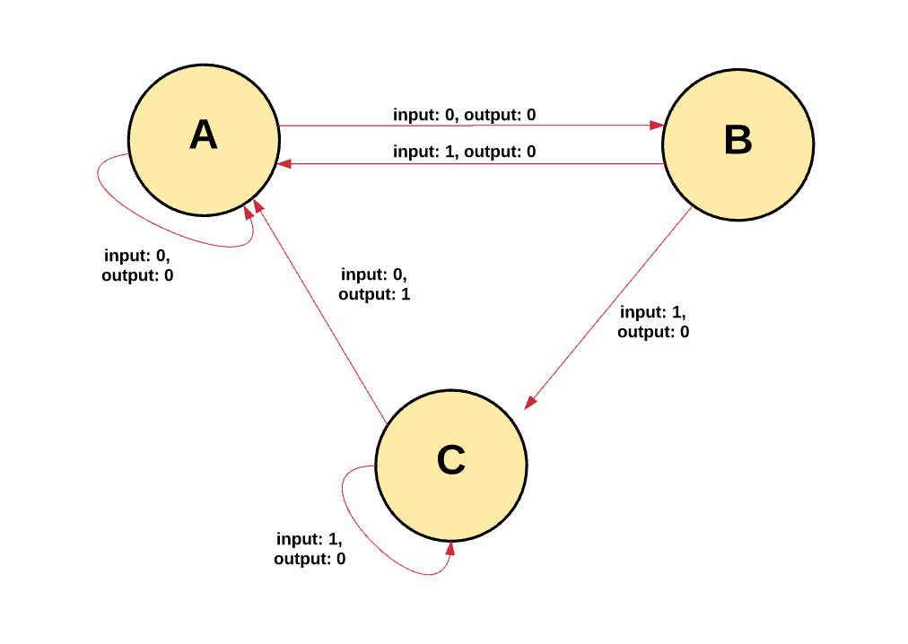

根据以太坊的状态机，我们从创世纪状态(genesis state)开始。这差不多类似于一片空白的石板，在网络中还没有任何交易的产生状态。当交易被执行后，这个创世纪状态就会转变成最终状态。在任何时刻，这个最终状态都代表着以太坊当前的状态。

以太坊的状态有百万个交易。这些交易都被“组团”到一个区块中。一个区块包含了一系列的交易，每个区块都与它的前一个区块链接起来。

为了让一个状态转换成下一个状态，交易必须是有效的。为了让一个交易被认为是有效的，它必须要经过一个验证过程，此过程也就是挖矿。挖矿就是一组节点（即电脑）用它们的计算资源来创建一个包含有效交易的区块出来。

任何在网络上宣称自己是矿工的节点都可以尝试创建和验证区块。世界各地的很多矿工都在同一时间创建和验证区块。每个矿工在提交一个区块到区块链上的时候都会提供一个数学机制的“证明”，这个证明就像一个保证：如果这个证明存在，那么这个区块一定是有效的。

为了让一个区块添加到主链上，一个矿工必须要比其他矿工更快的提供出这个“证明”。通过矿工提供的一个数学机制的“证明”来证实每个区块的过程称之为工作量证明(proof of work)。

证实了一个新区块的矿工都会被奖励一定价值的奖赏。奖赏是什么？以太坊使用一种内在数字代币—以太币(Ether)作为奖赏。每次矿工证明了一个新区块，那么就会产生一个新的以太币并被奖励给矿工。

你也许会在想：什么能确保每个人都只在区块的同一条链上呢？我们怎么能确定不会存在一部分矿工创建一个他们自己的链呢？

前面，我们定义了区块链就是一个具有共享状态的交易单机。使用这个定义，我们可以知道正确的当前状态是一个全球真相，所有人都必须要接受它。拥有多个状态（或多个链）会摧毁这个系统，因为它在哪个是正确状态的问题上不可能得到统一结果。如果链分叉了，你有可能在一条链上拥有10个币，一条链上拥有20个币，另一条链上拥有40个币。在这种场景下，是没有办法确定哪个链才是最”有效的“。

不论什么时候只要多个路径产生了，一个”分叉“就会出现。我们通常都想避免分叉，因为它们会破坏系统，强制人们去选择哪条链是他们相信的链。

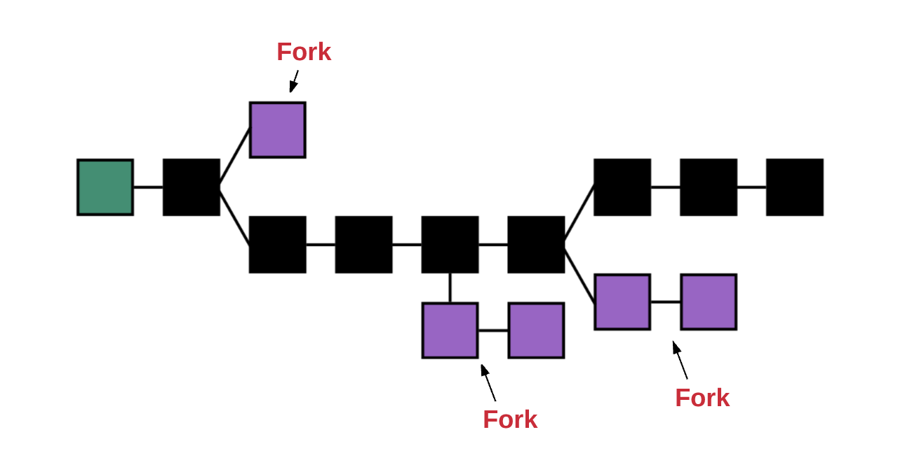

为了确定哪个路径才是最有效的以及防止多条链的产生，以太坊使用了一个叫做“GHOST协议(GHOST protocol.)”的数学机制。

> GHOST = Greedy Heaviest Observed Subtree

简单来说，GHOST协议就是让我们必须选择一个在其上完成计算最多的路径。一个方法确定路径就是使用最近一个区块（叶子区块）的区块号，区块号代表着当前路径上总的区块数（不包含创世纪区块）。区块号越大，路径就会越长，就说明越多的挖矿算力被消耗在此路径上以达到叶子区块。使用这种推理就可以允许我们赞同当前状态的权威版本。

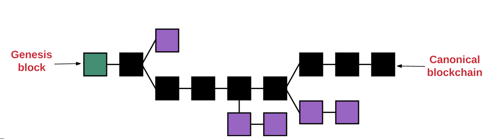

现在你大概对区块链是什么有个理性的认识，让我们在再深入了地解一下以太坊系统主要组成部分：

1. 账户(accounts)
2. 状态(state)
3. 损耗和费用(gas and fees)
4. 交易(transactions)
5. 区块(blocks)
6. 交易执行(transaction execution)
7. 挖矿(mining)
8. 工作量证明(proof of work)

在开始之前需要注意的是：每当我说某某的hash， 我指的都是KECCAK-256 hash, 以太坊就是使用这个hash算法。

## 四、账户
以太坊的全局“共享状态”是有很多小对象（账户）来组成的，这些账户可以通过消息传递架构来与对方进行交互。每个账户都有一个与之关联的状态(state)和一个20字节的地址(address)。在以太坊中一个地址是160位的标识符，用来识别账户的。

这是两种类型的账户：

1. 外部拥有的账户，被私钥控制且没有任何代码与之关联
2. 合约账户，被它们的合约代码控制且有代码与之关联

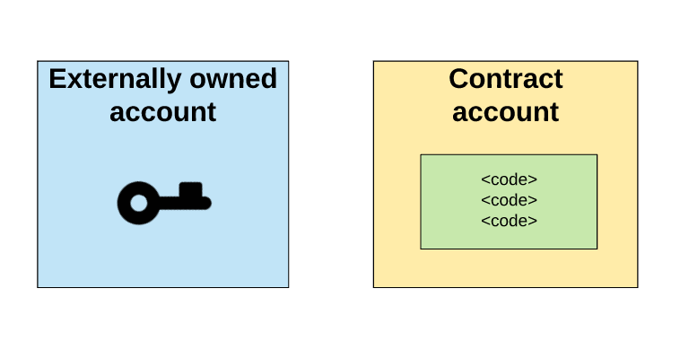

## 五、外部拥有账户与合约账户的比较
理解外部拥有账户和合约账户的基本区别是很重要的。一个外部拥有账户可以通过创建和用自己的私钥来对交易进行签名，来发送消息给另一个外部拥有账户或合约账户。在两个外部拥有账户之间传送的消息只是一个简单的价值转移。但是从外部拥有账户到合约账户的消息会激活合约账户的代码，允许它执行各种动作。（比如转移代币，写入内部存储，挖出一个新代币，执行一些运算，创建一个新的合约等等）。

不像外部拥有账户，合约账户不可以自己发起一个交易。相反，合约账户只有在接收到一个交易之后(从一个外部拥有账户或另一个合约账户接)，为了响应此交易而触发一个交易。我们将会在“交易和消息”部分来了解关于合约与合约之间的通信。

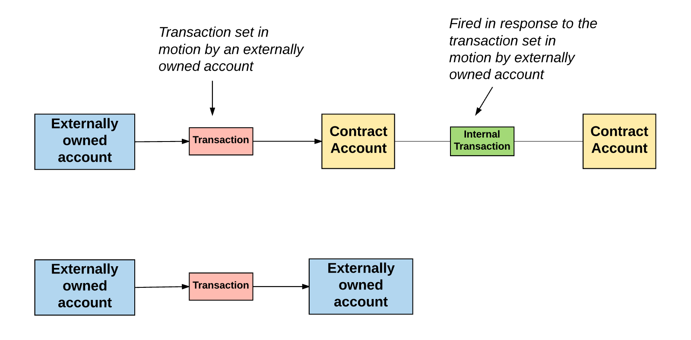

因此，在以太坊上任何的动作，总是被外部控制账户触发的交易所发动的。

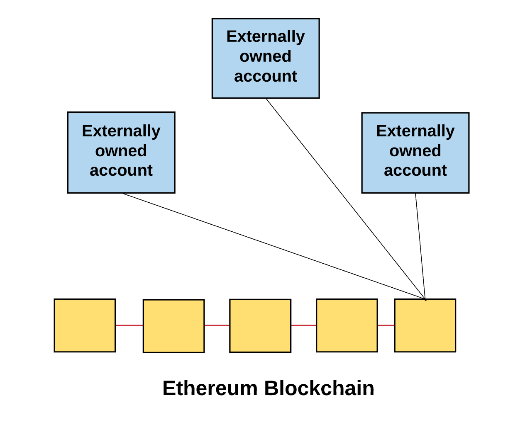

## 六、账户状态
账户状态有四个组成部分，不论账户类型是什么，都存在这四个组成部分：

1. nonce：如果账户是一个外部拥有账户，nonce代表从此账户地址发送的交易序号。如果账户是一个合约账户，nonce代表此账户创建的合约序号
2. balance： 此地址拥有Wei的数量。1Ether=10^18Wei
3. storageRoot： Merkle Patricia树的根节点Hash值（我们后面在解释Merkle树）。Merkle树会将此账户存储内容的Hash值进行编码，默认是空值
4. codeHash：此账户EVM（以太坊虚拟机，后面细说）代码的hash值。对于合约账户，就是被Hash的代码并作为codeHash保存。对于外部拥有账户，codeHash域是一个空字符串的Hash值

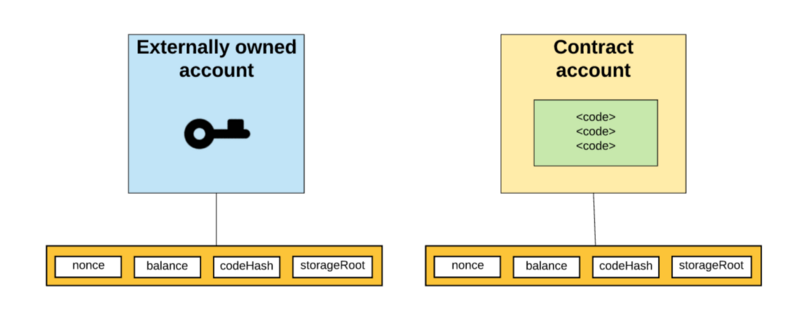

## 七、世界状态
好了，我们知道了以太坊的全局状态就是由账户地址和账户状态的一个映射组成。这个映射被保存在一个叫做Merkle Patricia树的数据结构中
Merkle Tree（也被叫做Merkle trie）是一种由一系列节点组成的二叉树，这些节点包括：

1. 在树底的包含了源数据的大量叶子节点
2. 一系列的中间的节点，这些节点是两个子节点的Hash值
3. 一个根节点，同样是两个子节点的Hash值，代表着整棵树

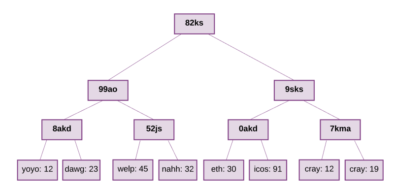

树底的数据是通过分开我们想要保存到chunks的数据产生的，然后将chunks分成buckets，再然后再获取每个bucket的hash值并一直重复直到最后只剩下一个Hash：根Hash。

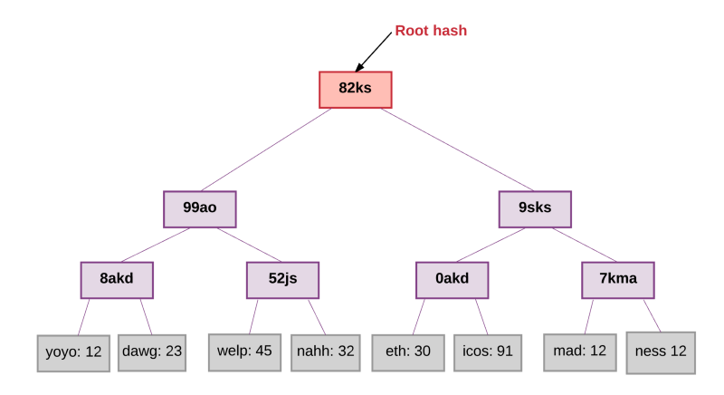

这棵树要求存在里面的值（value）都有一个对应的key。从树的根节点开始，key会告诉你顺着哪个子节点可以获得对应的值，这个值存在叶子节点。在以太坊中，key/value是地址和与地址相关联的账户之间状态的映射，包括每个账户的balance, nonce, codeHash和storageRoot（storageRoot自己就是一颗树）。

同样的树结构也用来存储交易和收据。更具体的说，每个块都有一个头(header)，保存了三个不同Merkle trie结构的根节点的Hash，包括：

1. 状态树
2. 交易树
3. 收据树

在Merkle tries中存储所有信息的高效性在以太坊中的“轻客户端”和“轻节点”相当的有用。记住区块链就是一群节点来维持的。广泛的说，有两种节点类型：全节点和轻节点。

全节点通过下载整条链来进行同步，从创世纪块到当前块，执行其中包含的所有交易。通常，矿工会存储全节点，因为他们在挖矿过程中需要全节点。也有可能下载一个全节点而不用执行所有的交易。无论如何，一个全节点包含了整个链。

不过除非一个节点需要执行所有的交易或轻松访问历史数据，不然没必要保存整条链。这就是轻节点概念的来源。比起下载和存储整个链以及执行其中所有的交易，轻节点仅仅下载链的头，从创世纪块到当前块的头，不执行任何的交易或检索任何相关联的状态。由于轻节点可以访问块的头，而头中包含了3个tries的Hash，所有轻节点依然可以很容易生成和接收关于交易、事件、余额等可验证的答案。

这个可以行的通是因为在Merkle树中hash值是向上传播的—如果一个恶意用户试图用一个假交易来交换Merkle树底的交易，这个会改变它上面节点的hash值，而它上面节点的值的改变也会导致上上一个节点Hash值的改变，以此类推，一直到树的根节点。

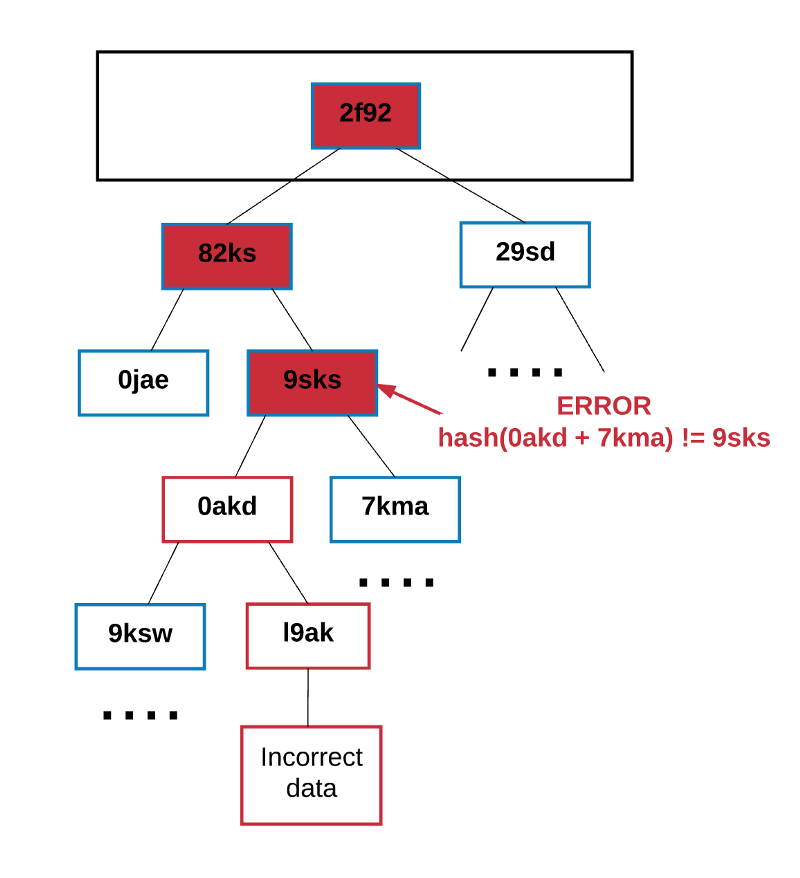

任何节点想要验证一些数据都可以通过Merkle证明来进行验证，Merkle 证明的组成：

1. 一块需要验证的数据
2. 树的根节点Hash
3. 一个“分支”（从 chunk到根这个路径上所有的hash值）

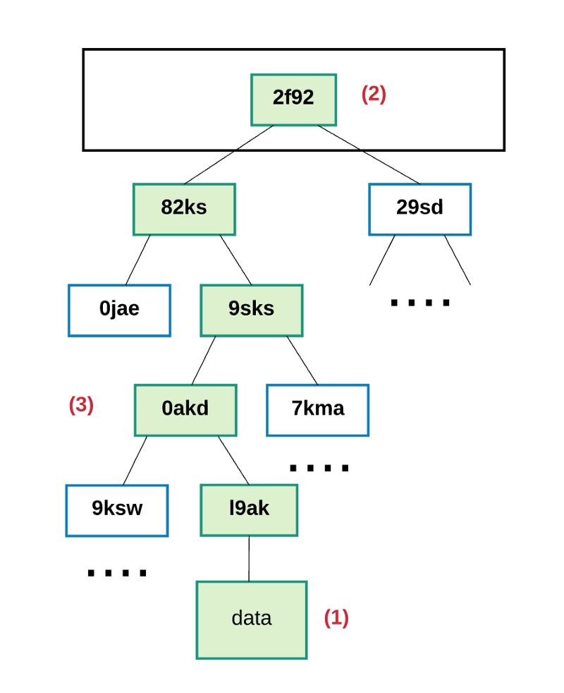

任何可以读取证明的人都可以验证分支的hash是连贯的，因此给出的块在树中实际的位置就是在此处。

总之，使用Merkle Patricia树的好处就是该结构的根节点加密取决于存储在树中的数据，而且根据点的hash还可以作为该数据的安全标识。由于块的头包含了状态、交易、收据树的根hash，所有任何节点都可以验证以太坊的一小部分状态而不用保存整个状态，这整个状态的的大小可能是非常大的。

## 八、Gas和费用
在以太坊中一个比较重要的概念就是费用(fees)，由以太坊网络上的交易而产生的每一次计算，都会产生费用—没有免费的午餐。这个费用是以称之为”gas”的来支付。

gas就是用来衡量在一个具体计算中要求的费用单位。gas price就是你愿意在每个gas上花费Ether的数量，以“gwei”进行衡量。“Wei”是Ether的最小单位，1Ether表示10^18Wei. 1gwei是1,000,000,000 Wei。

对每个交易，发送者设置gas limit和gas price。gas limit和gas price就代表着发送者愿意为执行交易支付的Wei的最大值。

例如，假设发送者设置gas limit为50,000，gas price为20gwei。这就表示发送者愿意最多支付50,000*20gwei = 1,000,000,000,000,000 Wei = 0.001 Ether来执行此交易。

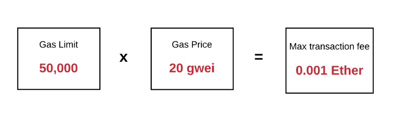

记住gas limit代表用户愿意花费在gas上的钱的最大值。如果在他们的账户余额中有足够的Ether来支付这个最大值费用，那么就没问题。在交易结束时任何未使用的gas都会被返回给发送者，以原始费率兑换。

在发送者没有提供足够的gas来执行交易，那么交易执行就会出现“gas不足”然后被认为是无效的。在这种情况下，交易处理就会被终止以及所有已改变的状态将会被恢复，最后我们就又回到了交易之前的状态—完完全全的之前状态就像这笔交易从来没有发生。因为机器在耗尽gas之前还是为计算做出了努力， 所以理论上，将不会有任何的gas被返回给发送者。

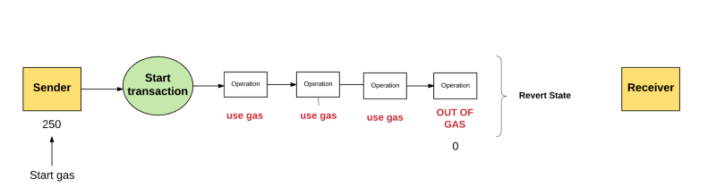

这些gas的钱到底去了哪里？发送者在gas上花费的所有钱都发送给了“受益人”地址，通常情况下就是矿工的地址。因为矿工为了计算和验证交易做出了努力，所以矿工接收gas的费用作为奖励。

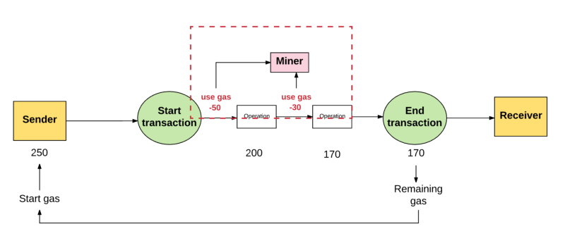

通常，发送者愿意支付更高的gas price，矿工从这笔交易总就能获得更多的价值。因此，矿工也就更加愿意选择这笔交易。这样的话，矿工可以自由的选择一笔交易自己愿意验证或忽略。为了引导发送者应该设置gas price为多少，矿工可以选择建议一个最小的gas值他们愿意执行一个交易。

## 九、存储也有费用
gas不仅仅是用来支付计算这一步的费用，而且也用来支付存储的费用。存储的总费用与所使用的32位字节的最小倍数成比例。

存储费用有一些比较细微的方面。比如，由于增加了的存储增加了所有节点上的以太坊状态数据库的大小，所以激励保持数据存储量小。为了这个原因，如果一个交易的执行有一步是清除一个存储实体，那么为执行这个操作的费用就会被放弃，并且由于释放存储空间的退款就会被返回给发送者。

## 十、费用的作用是什么？
以太坊可以运作的一个重要方面就是每个网络执行的操作同时也被全节点所影响。然而，计算的操作在以太坊虚拟机上是非常昂贵的。因此，以太坊智能合约最好是用来执行最简单的任务，比如运行一个简单的业务逻辑或者验证签名和其他密码对象，而不是用于复杂的操作，比如文件存储，电子邮件，或机器学习，这些会给网络造成压力。施加费用防止用户使网络超负荷。

以太坊是一个图灵完备语言（短而言之，图灵机器就是一个可以模拟任何电脑算法的机器。对于图灵机器不太熟悉的人可以看看这个 和这个 ）。这就允许有循环，并使以太坊受到停机问题 的影响，这个问题让你无法确定程序是否无限制的运行。如果没有费用的话，恶意的执行者通过执行一个包含无限循环的交易就可以很容易的让网络瘫痪而不会产生任何反响。因此，费用保护网络不受蓄意攻击。

你也许会想，“为什么我们还需要为存储付费？”其实就像计算一样，以太坊网络上的存储是整个网络都必须要负担的成本。

## 十一、交易和消息
之前说过以太坊是一个基于交易的状态机。换句话说，在两个不同账户之间发生的交易才让以太坊全球状态从一个状态转换成另一个状态。

最基本的概念，一个交易就是被外部拥有账户生成的加密签名的一段指令，序列化，然后提交给区块链。

有两种类型的交易：消息通信和合约创建(也就是交易产生一个新的以太坊合约)。

不管什么类型的交易，都包含：

1. nonce：发送者发送交易数的计数
2. gasPrice：发送者愿意支付执行交易所需的每个gas的Wei数量
3. gasLimit：发送者愿意为执行交易支付gas数量的最大值。这个数量被设置之后在任何计算完成之前就会被提前扣掉
4. to：接收者的地址。在合约创建交易中，合约账户的地址还没有存在，所以值先空着
5. value：从发送者转移到接收者的Wei数量。在合约创建交易中，value作为新建合约账户的开始余额
6. v,r,s：用于产生标识交易发生着的签名
7. init（只有在合约创建交易中存在）：用来初始化新合约账户的EVM代码片段。init值会执行一次，然后就会被丢弃。当init第一次执行的时候，它返回一个账户代码体，也就是永久与合约账户关联的一段代码。
8. data（可选域，只有在消息通信中存在）：消息通话中的输入数据(也就是参数)。例如，如果智能合约就是一个域名注册服务，那么调用合约可能就会期待输入域例如域名和IP地址

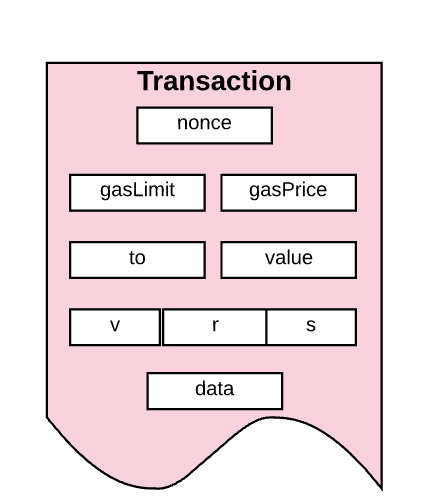

在“账户”这个章节中我们学到交易—消息通信和合约创建交易两者都总是被外部拥有账户触发并提交到区块链的。换种思维思考就是，交易是外部世界和以太坊内部状态的桥梁。

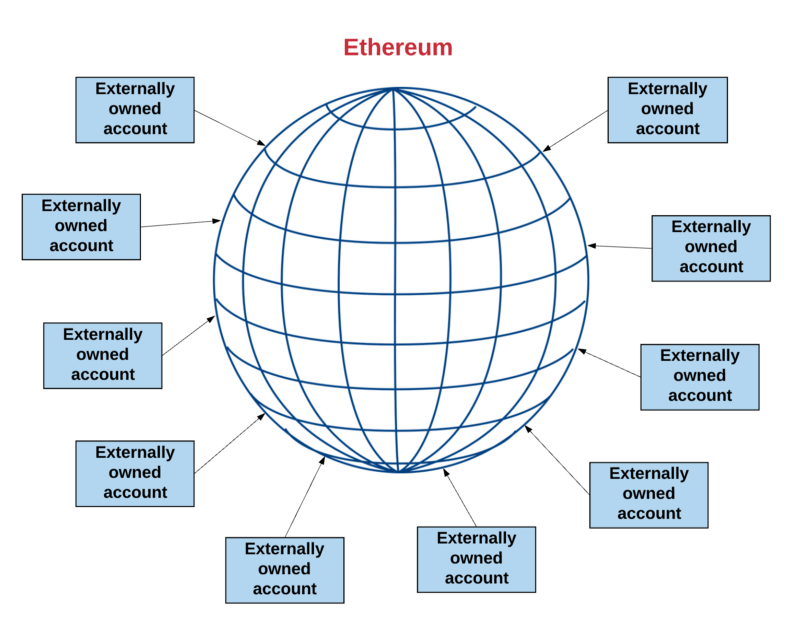

但是这也并不代表一个合约与另一个合约无法通信。在以太坊状态全局范围内的合约可以与在相同范围内的合约进行通信。他们是通过“消息”或者“内部交易”进行通信的。我们可以认为消息或内部交易类似于交易，不过与交易有着最大的不同点—它们不是由外部拥有账户产生的。相反，他们是被合约产生的。它们是虚拟对象，与交易不同，没有被序列化而且只存在与以太坊执行环境。

当一个合约发送一个内部交易给另一个合约，存在于接收者合约账户相关联的代码就会被执行。

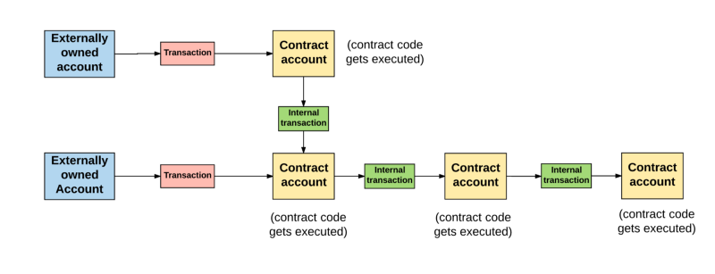

一个重要需要注意的事情是内部交易或者消息不包含gasLimit。因为gas limit是由原始交易的外部创建者决定的（也就是外部拥有账户）。外部拥有账户设置的gas limit必须要高到足够将交易完成，包括由于此交易而长生的任何”子执行”，例如合约到合约的消息。如果，在一个交易或者信息链中，其中一个消息执行使gas已不足，那么这个消息的执行会被还原，包括任何被此执行触发的子消息。不过，父执行没必要被还原。

## 十二、区块
所有的交易都被组成一个”块”。一个区块链包含了一系列这样的链在一起区块。

在以太坊中，一个区块包含：

1. 区块头
2. 关于包含在此区块中交易集的信息
3. 与当前块的ommers相关的一系列其他区块头

## 十三、Ommers解释
“ommer”到底是什么？ ommer就是一个区块的父区块与当前区块父区块的父区块是相同的。让我们快速了解一下ommers是用来干嘛的，并且为什么一个区块需要为ommers包含区块头。

由于以太坊的构造，它的区块生产时间（大概15秒左右）比其他的区块链例如Bitcoin（大概10分钟左右）要快很多。这使得交易的处理更快。但是，更短的区块生产时间的一个缺点就是：更多的竞争区块会被矿工发现。这些竞争区块同样也被称为“孤区块”（也就是被挖出来但是不会被添加到主链上的区块）。

Ommers的目的就是为了帮助奖励矿工纳入这些孤区块。矿工包含的ommers必须是有效的，也就是ommers必须在父区块的第6个子区块之内或更小范围内。在第6个子区块之后，陈旧的孤区块将不会再被引用（因为包含老旧的交易会使事情变得复杂一点）。

Ommer区块会收到比全区块少一点的奖励。不管怎样，依然存在激励来让矿工们纳入孤区块并能从中获得一些报酬。

## 十四、区块头
让我们再回到区块的问题上。我们前面提到每个区块都有一个“区块头”，但这究竟是什么？
区块头是一个区块的一部分，包含了：

1. parentHash：父区块头的Hash值（这也是使得区块变成区块链的原因）
2. ommerHash：当前区块ommers列表的Hash值
3. beneficiary：接收挖此区块费用的账户地址
4. stateRoot：状态树根节点的Hash值（回忆一下我们之前所说的保存在头中的状态树以及它使得轻客户端认证任何关于状态的事情都变得非常简单）
5. transactionsRoot：包含此区块所列的所有交易的树的根节点Hash值
6. receiptsRoot：包含此区块所列的所有交易收据的树的根节点Hash值
7. logsBloom：由日志信息组成的一个Bloom过滤器 （数据结构）
8. difficulty： 此区块的难度级别
9. number：当前区块的计数（创世纪块的区块序号为0，对于每个后续区块，区块序号都增加1）
10. gasLimit：每个区块的当前gas limit
11. gasUsed： 此区块中交易所用的总gas量
12. timestamp：此区块成立时的unix的时间戳
13. extraData：与此区块相关的附加数据
14. mixHash：一个Hash值，当与nonce组合时，证明此区块已经执行了足够的计算
15. nonce：一个Hash值，当与mixHash组合时，证明此区块已经执行了足够的计算

注意每个区块是如何包含三个树结构的，三个树结构分别对应：

1. 状态（stateRoot）
2. 交易（transactionsRoot）
3. 收据（receiptsRoot）

这三个树结构就是我们前面讨论的Merkle Patricia树。

另外，上面描述的有几个术语值得说明一下，下面来看一下。

## 十五、日志
以太坊允许日志可以跟踪各种交易和信息。一个合约可以通过定义“事件”来显示的生成日志。

一个日志的实体包含：

1. 记录器的账户地址
2. 代表本次交易执行的各种事件的一系列主题以及与这些事件相关的任何数据

日志被保存在bloom过滤器 中，过滤器高效的保存了无尽的日志数据。

## 十六、交易收据
自于被包含在交易收据中的日志信息存储在头中。就像你在商店买东西时收到的收据一样，以太坊为每笔交易都产生一个收据。像你期望的那样，每个收据包含关于交易的特定信息。这些收据包含着：

1. 区块序号
2. 区块Hash
3. 交易Hash
4. 当前交易使用了的gas
5. 在当前交易执行完之后当前块使用的累计gas
6. 执行当前交易时创建的日志
7. 等等

## 十七、区块难度
区块的难度是被用来在验证区块时加强一致性。创世纪区块的难度是131,072，有一个特殊的公式用来计算之后的每个块的难度。如果某个区块比前一个区块验证的更快，以太坊协议就会增加区块的难度。

区块的难度影响nonce，它是在挖矿时必须要使用proof-of-work算法来计算的一个hash值。

区块难度和nonce之间的关系用数学形式表达就是：

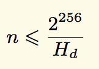

Hd代表的是难度。

找到符合难度阈值的nonce唯一方法就是使用proof-of-work算法来列举所有的可能性。找到解决方案预期时间与难度成正比—难度越高，找到nonce就越困难，因此验证一个区块也就越难，这又相应地增加了验证新块所需的时间。所以，通过调整区块难度，协议可以调整验证区块所需的时间。

另一方面，如果验证时间变的越来越慢，协议就会降低难度。这样的话，验证时间自我调节以保持恒定的速率—平均每15s一个块。

## 十八、交易执行
我们已经到了以太坊协议最复杂的部分：交易的执行。假设你发送了一笔交易给以太坊网络处理，将以太坊状态转换成包含你的交易这个过程到底发生了什么？

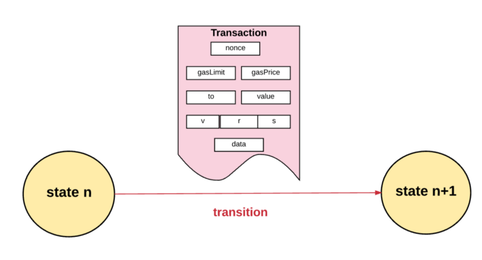

首先，为了可以被执行所有的交易必须都要符合最基础的一系列要求，包括：

* 交易必须是正确格式化的RLP。”RLP”代表Recursive Length Prefix，它是一种数据格式，用来编码二进制数据嵌套数组。以太坊就是使用RLP格式序列化对象。
* 有效的交易签名。
* 有效的交易序号。回忆一下账户中的nonce就是从此账户发送出去交易的计数。如果有效，那么交易序号一定等于发送账户中的nonce。
* 交易的gas limit 一定要等于或者大于交易使用的intrinsic gas，intrinsic gas包括： ——-1.执行交易预订费用为21,000gas ——-2.随交易发送的数据的gas费用（每字节数据或代码为0的费用为4gas，每个非零字节的数据或代码费用为68gas） ——-3.如果交易是合约创建交易，还需要额外的32,000gas

* 发送账户余额必须有足够的Ether来支付”前期”gas费用。前期gas费用的计算比较简单：首先，交易的gas limit乘以交易的gas价格得到最大的gas费用。然后，这个最大gas费用被加到从发送方传送给接收方的总值。

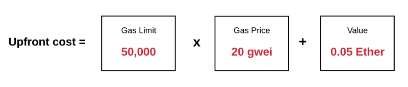

如何交易符合上面所说的所有要求，那么我们进行下面步骤。

第一步，我们从发送者的余额中扣除执行的前期费用，并为当前交易将发送者账户中的nonce增加1。此时，我们可以计算剩余的gas，将交易的总gas减去使用的intrinsic gas。

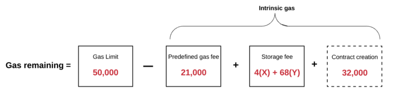

第二步，开始执行交易。在交易执行的整个过程中，以太坊保持跟踪“子状态”。子状态是记录在交易中生成的信息的一种方式，当交易完成时会立即需要这些信息。具体来说，它包含：

1. 自毁集：在交易完成之后会被丢弃的账户集（如果存在的话）
2. 日志系列：虚拟机的代码执行的归档和可检索的检查点
3. 退款余额：交易完成之后需要退还给发送账户的总额。回忆一下我们之前提到的以太坊中的存储需要付费，发送者要是清理了内存就会有退款。以太坊使用退款计数进行跟踪退款余额。退款计数从0开始并且每当合约删除了一些存储中的东西都会进行增加。

第三步，交易所需的各种计算开始被处理。
当交易所需的步骤全部处理完成，并假设没有无效状态，通过确定退还给发送者的未使用的gas量，最终的状态也被确定。除了未使用的gas，发送者还会得到上面所说的“退款余额”中退还的一些津贴。

一旦发送者得到退款之后：

1. gas的Ether就会矿工
2. 交易使用的gas会被添加到区块的gas计数中（计数一直记录当前区块中所有交易使用的gas总量，这对于验证区块时是非常有用的）
3. 所有在自毁集中的账户（如果存在的话）都会被删除

最后，我们就有了一个新的状态以及交易创建的一系列日志。

现在我们已经介绍了交易执行的基本知识，让我们再看看合约创建交易和消息通信的一些区别。

## 十九、合约创建(Contract creation)
回忆一下在以太坊中，有两种账户类型：合约账户和外部拥有账户。当我们说一个交易是“合约创建”，是指交易的目的是创建一个新的合约账户。
为了创建一个新的合约账户，我们使用一个特殊的公式来声明新账户的地址。然后我们使用下面的方法来初始化一个账户：

1. 设置nonce为0
2. 如果发送者通过交易发送了一定量的Ether作为value，那么设置账户的余额为value
3. 将存储设置为0
4. 设置合约的codeHash为一个空字符串的Hash值

一旦我们完成了账户的初始化，使用交易发送过来的init code（查看”交易和信息”章节来复习一下init code），实际上就创造了一个账户。init code的执行过程是各种各样的。取决于合约的构造器，可能是更新账户的存储，也可能是创建另一个合约账户，或者发起另一个消息通信等等。

当初始化合约的代码被执行之后，会使用gas。交易不允许使用的gas超过剩余gas。如果它使用的gas超过剩余gas，那么就会发生gas不足异(OOG)常并退出。如果一个交易由于gas不足异常而退出，那么状态会立刻恢复到交易前的一个点。发送者也不会获得在gas用完之前所花费的gas。

不过，如果发送者随着交易发送了Ether，即使合约创建失败Ether也会被退回来。

如果初始化代码成功的执行完成，最后的合约创建的花费会被支付。这些是存储成本，与创建的合约代码大小成正比（再一次，没有免费的午餐）。如果没有足够的剩余gas来支付最后的花费，那么交易就会再次宣布gas不足异常并中断退出。

如果所有的都正常进行没有任何异常出现，那么任何剩余的未使用gas都会被退回给原始的交易发送者，现在改变的状态才被允许永久保存。

## 二十、消息通信(Message calls)
消息通信的执行与合约创建比较类似，只不过有一点点区别。

由于没有新账户被创建，所以消息通信的执行不包含任何的init code。不过，它可以包含输入数据，如果交易发送者提供了此数据的话。一旦执行，消息通信同样会有一个额外的组件来包含输出数据，如果后续执行需要此数据的话就组件就会被使用。

就像合约创建一样，如果消息通信执行退出是因为gas不足或交易无效（例如栈溢出，无效跳转目的地或无效指令），那么已使用的gas是不会被退回给原始触发者的。相反，所有剩余的未使用gas也会被消耗掉，并且状态会被立刻重置为余额转移之前的那个点。

没有任何方法停止或恢复交易的执行而不让系统消耗你提供的所有gas，直到最新的以太坊更新。例如，假设你编写了一个合约，当调用者没有授权来执行这些交易的时候抛出一个错误。在以太坊的前一个版本中，剩余的gas也会被消耗掉，并且没有任何gas退回给发送者。但是拜占庭更新包括了一个新的“恢复”代码，允许合约停止执行并且恢复状态改变而不消耗剩余的gas，此代码还拥有返回交易失败原因的能力。如果一个交易是由于恢复而退出，那么未使用的gas就会被返回给发送者。

## 二十一、执行模式
到目前为止，我们了解了从开始到结束执行的交易必须经历的一系列的步骤。现在，我们来看看交易究竟是如何在虚拟机(VM)中执行的。

协议实际操作交易处理的部分是以太坊自己的虚拟机，称之为以太坊虚拟机(EVM)。

像之前定义的那样，EVM是图灵完备虚拟机器。EVM存在而典型图灵完备机器不存在的唯一限制就是EVM本质上是被gas束缚。因此，可以完成的计算总量本质上是被提供的gas总量限制的。

此外，EVM具有基于堆栈的架构。堆栈机器 就是使用后进先出来保存临时值的计算机。

EVM中每个堆栈项的大小为256位，堆栈有一个最大的大小，为1024位。

EVM有内存，项目按照可寻址字节数组来存储。内存是易失性的，也就是数据是不持久的。

EVM也有一个存储器。不像内存，存储器是非易失性的，并作为系统状态的一部分进行维护。EVM分开保存程序代码，在虚拟ROM 中只能通过特殊指令来访问。这样的话，EVM就与典型的冯·诺依曼架构 不同，此架构将程序的代码存储在内存或存储器中。

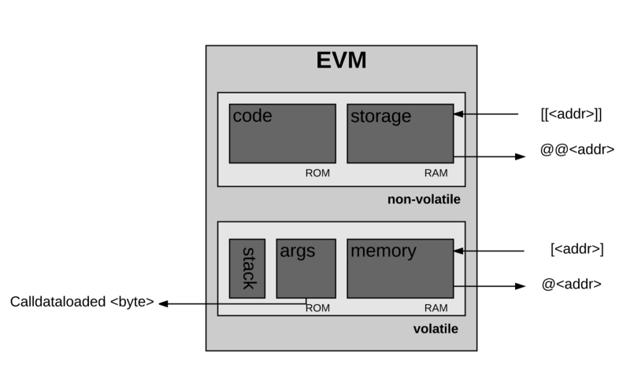

EVM同样有属于它自己的语言：“EVM字节码”，当一个程序员比如你或我写一个在以太坊上运行的智能合约时，我们通常都是用高级语言例如Solidity来编写代码。然后我们可以将它编译成EVM可以理解的EVM字节码。

好了，现在来说执行。

在执行特定的计算之前，处理器会确定下面所说的信息是有效和是否可获取：

1. 系统状态
2. 用于计算的剩余gas
3. 拥有执行代码的账户地址
4. 原始触发此次执行的交易发送者的地址
5. 触发代码执行的账户地址（可能与原始发送者不同）
6. 触发此次执行的交易gas价格
7. 此次执行的输入数据
8. Value(单位为Wei)作为当前执行的一部分传递给该账户
9. 待执行的机器码
10. 当前区块的区块头
11. 当前消息通信或合约创建堆栈的深度

执行刚开始时，内存和堆栈都是空的，程序计数器为0。

1 PC: 0 STACK: [] MEM: [], STORAGE: {}

然后EVM开始递归的执行交易，为每个循环计算系统状态和机器状态。系统状态也就是以太坊的全局状态(global state)。机器状态包含：

1. 可获取的gas
2. 程序计数器
3. 内存的内容
4. 内存中字的活跃数
5. 堆栈的内容

堆栈中的项从系列的最左边被删除或者添加。
每个循环，剩余的gas都会被减少相应的量，程序计数器也会增加。 在每个循环的结束，都有三种可能性：

1. 机器到达异常状态（例如 gas不足，无效指令，堆栈项不足，堆栈项会溢出1024，无效的JUMP/JUMPI目的地等等）因此停止，并丢弃任何的更改
2. 进入后续处理下一个循环
3. 机器到达了受控停止（到达执行过程的终点）

假设执行没有遇到异常状态，达到一个“可控的”或正常的停止，机器就会产生一个合成状态，执行之后的剩余gas、产生的子状态、以及组合输出。

呼。我们终于过了一遍以太坊最难的部分了。如果你不能完全理解这个部分，也没关系。除非你在理解非常深层次的东西，否则你真的没有必要去理解执行的每个细节。

## 二十二、一个块是如何完成的？
最后，让我们看看一个包含许多交易的块是如何完成的。
当我们说“完成”，取决于此块是新的还是已存在的，可以指两个不同的事情。如果是个新块，就是指挖这个块所需的处理。如果是已存在的块，就是指验证此块的处理。不论哪种情况，一个块的“完成”都有4个要求：
 
1）验证（或者，如果是挖矿的话，就是确定）ommers 在区块头中的每个ommer都必须是有效的头并且必须在当前块的6代之内

2）验证（或者，如果是挖矿的话，就是确定）交易 区块中的gasUsed数量必须与区块中所列交易使用的累积gas量相等。（回忆一下，当执行一个交易的时候，我们会跟踪区块的gas计数器，也就跟踪了区块中所有交易使用的gas总数量）

3）申请奖励（只有挖矿时） 受益人的地址会因为挖矿而获得5Ether（在以太坊EIP-649 提案中，5ETH很快将会被减少为3ETH）。另外，对于每个ommer，当前块的受益人会获得额外的1/32当前块奖励金的奖励。最近，每个ommer区块的受益人能够得到一定量的奖励（有个特殊公式可以进行计算）。

4）校验（或者，如果是挖矿的话，就是计算一个有效的）状态和nonce 确保所有的交易和改变的结果状态都被应用了，然后在区块奖励被应用于最终交易结果状态之后定义一个新块为状态。通过检查最终状态与存储在头中的状态树来进行验证。

## 二十三、工作量证明挖矿
在“区块”这个章节简短的说明了一下区块难度这个概念。给予区块难度意义的算法叫做工作量证明（PoW）。

以太坊的工作量证明算法称之为“Ethash” （之前叫做Dagger-Hashimoto）。 算法正式定义为：

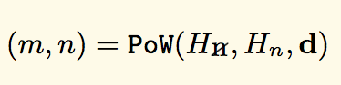

m代表的是mixHash，n代表的是nonce，Hn代表的是新区块的头（不包含需要计算的nonce和mixHash），Hn是区块头的nonce，d是DAG ，就是一个大数据集。

在”区块”章节，我们讨论了存在于区块头中的多项。其中两项叫做mixHash和nonce。也许你会回忆起：

1. mixHash：一个Hash值，当与nonce组合时，证明此区块已经执行了足够的计算
2. nonce：一个Hash值，当与mixHash组合时，证明此区块已经执行了足够的计算

PoW函数就是用来估算这两项的。 mixHash和nonce到底是如何使用PoW函数来计算出来的有点复杂，如果深入了解的话，我们可以另写一篇文章来讲解了。但是在一个高层面上，它大致就是这样计算的： 会为每个区块计算一个”种子”。每个“时期”的种子都不一样，每个时期是30,000个区块长度。对于第一时期，种子就是32位0的hash值。对于后续的每个时期，种子就是前一个种子hash值的hash值。使用这个种子，节点可以计算一个伪随机“缓存”。
这个缓存是非常有用的，因为它可以使“轻节点”的概念变成现实，轻节点概念在这篇文章的前面讨论过。轻节点的目的就是让某个节点有能力高效的校验交易而用不着存储整个区块链的数据集。一个轻节点可以仅基于缓存来校验一个交易的有效性，因为缓存可以重新生成需要校验的特定块。

使用这个缓存，节点可以生成DAG“数据集”，数据集中的每项取决于缓存中少量伪随机选择项。为了成为矿工，你需要要生成全数据集，所有全客户端和矿工都保存这个数据集，并且这个数据集随着时间线性增长。

然后矿工可以随机抽取数据集中的部分并将它们放入一个数学函数中Hash出一个”mixHash”。矿工会重复生成mixHash直到输出的值小于想要的目标值nonce。当输出的值符合这个条件的时候，nonce就被认为是有效的，然后区块就被添加到链中。

## 二十四、挖矿作为安全机制
总的来说，PoW的目的就是以加密安全的方式证明生成的一些输出（也就是nonce）是经过了一定量的计算的。因为除了列举所有的可能性，没有更好的其他方法来找到一个低于要求阈值的nonce。重复应用Hash函数的输出均匀分布，所以我们可以确保，在平均值上，找到满足要求的nonce所需时间取决于难度阈值。难度系数越大，所需时间越长。这样的话，PoW算法就给予难度这个概念的意义了：用来加强区块链的安全。

我们所说的区块链的安全又是什么意思？这非常简单：我们想要创造一个每个人都信任的区块链。像我们之前在这篇文章中讨论的那样，如果存在超过1条以上的链，用户的信任就会消失，因为他们没有能力合理的确认哪条链才是“有效的”。为了让一群用户接受存储在区块链中的潜在状态，我们需要有一群人信任的一个权威区块链。

这完完全全就是Pow算法所做的事情：它确保特定的区块链直到未来都一直保持着权威性，让攻击者创造一个新区块来重写某个历史部分（例如清除一个交易或者创建一个假的交易）或者保持一个分叉变得非常困难。为了首先让他们的区块被验证，攻击者需要总是比网络上的其他人要更快的解决掉nonce问题，这样网络就会相信他们的链是最重的链（基于我们之前提到的GHOST协议原则）。除非攻击者拥有超过一半的网络挖矿能力（这种场景也被称为大多数51%攻击 ），要不然这基本上是不可能的。

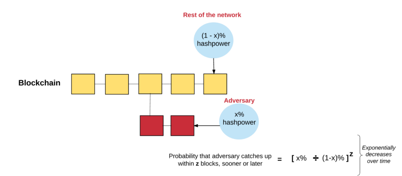

## 二十五、挖矿作为财富分配机制
除了提供一个安全的区块链，PoW同样也是分配财富给那些为提供这个安全而花费自己计算力的人的一种方法。回忆一下，一个矿工挖出一个区块的时候会获得奖励，包括：

1. 为“获胜”区块提供的5 ether静态区块奖励（马上就会变成3 ether ）
2. 区块中的交易在区块内所消耗的gas
3. 纳入ommers作为区块的一部分的额外奖励

为了保证PoW共识算法机制对安全和财富分配的使用是长期可持续的，以太坊努力灌输这两个特性：

1. 尽可能的让更多的人可访问。换句话说，人们不需要特殊的或者与众不同的硬件来运行这个算法。这样做的目的是为了让财富分配模式变的尽可能的开放，以便任何人都可以提供一些算力而获得Ether作为回报。
2. 降低任何单个节点（或小组）能够创造与其不成比例的利润可能性。任何可以创造不成比例的利润的节点拥有比较大的影响力来决定权威区块链。这是件麻烦的事情，因为这降低了网络的安全性。

在区块链网络中，一个与上面两个特性有关的一个问题是PoW算法是一个SHA256哈希函数。这种函数的缺点就是它使用特殊的硬件（也被称之为ASCIs）可以更加快速高效的解决nonce问题。
为了减轻这个问题，以太坊选择让PoW算法(Ethhash) 提高内存级别难度。意思是此算法被设计为计算出要求的nonce需要大量的内存和带宽。大量内存的需求让电脑平行的使用内存同时计算多个nonce变得极其困难，高带宽的需求让即使是超级电脑同时计算多个nonce也变得十分艰难。这种方式降低了中心化的风险，并为正在进行验证的几点提供了更加公平的竞争环境。

有一件值得注意的事情是以太坊正在从PoW共识机制渐渐转换为一个叫做“权益证明(PoS)”的共识算法。这就是一个比较野心的话题了，我们希望可以在未来的文章中探索这个话题。

## 二十六、总结
呼！ 你终于坚持到最后了。我希望如此？

这篇文章中有很多的地方需要消化。如果需要你阅读好几遍才能理解怎么回事，这完全正常。我个人重复阅读了好几次以太坊黄皮书，白皮书，以及代码的不同部分才渐渐明白是怎么回事。

无论如何，我希望你觉得这篇文章对你有帮助。如果你发现了任何的错误或失误，我很乐意你给我写个私人消息或者直接在评论区评论（我保证我会查看所有评论）。

记住，我是个人类（对，这是真的），我会犯错误。为了社区的利益，我花时间免费写了这篇文章。所以请你在反馈时不要带着没必要的攻击性，尽量是建设性的反馈。
