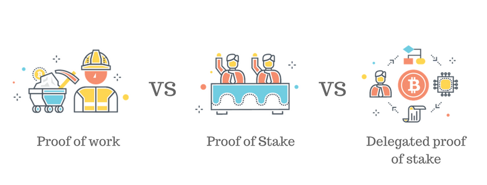

## 一、什么是共识机制
上一节讲了区块链是由区块组成的链条，分布式的存储在所有节点（服务器）上，每个节点上的链条是一致的。那么面临的一个难题就是，如何同时存储的时候保持一致，必须有一个规则，这个规则就是共识机制。比较常用的有POW（工作量证明），POS（权益证明），DPOS（代理权益证明）等等。

## 二、什么是POW？
>POW（Proof Of Work）工作量证明，就是谁能力越高听谁的。

PoW是最有名的共识机制，我们熟知的BTC，ETH，LTC等，均使用该机制。PoW可以说就是挖矿获得多少货币奖励，取决于挖矿贡献的有效工作，也就是说，矿机的性能越好、挖矿时间越长，所获得的货币奖励就越多。保证付出一定成本才能有一定收获的原则，PoW给整个区块链带来了鲜活的支撑力量——矿工。然而PoW机制存在的同时，是一个足够数量的矿工支持。而且随着交易量的扩大，计算难度的影响等，PoW机制背后的交易速度变慢，需要给矿工的费用增加，人们在整个网络的交易手续费也提高。在这里我们可以把以太坊主网比作一架飞机，飞机一次的载客量有限，而大家都争着想要乘上这趟航班，那这趟航班机票的价格自然会很高。

**PoW的优点**

PoW（工作量证明），通过非常复杂的运算从众多节点中选出了拥有记账权的节点 ，使节点付出很大的代价获得记账权，增大了节点作假的成本，极大程度上保证了整个网络的安全性。

**PoW的缺点**

PoW共识机制中绝大多数的算力都是浪费的，从结果上来说所有的节点都在做毫无意义的运算，截至2017年11月20日，整个比特币网络耗费的电力已经超过了159个国家的年度用电量。

比特币网络平均10分钟形成一个区块，很多区块被确认时间超过2个小时，交易速度延迟度非常高。

## 三、什么是POS？
>PoS（Proof of Stake）直译过来就是股权证明，即谁最有钱听谁的。 

PoS 试图解决 PoW 机制中大量资源被浪费的情况。这种机制通过计算你持有占总币数的百分比以及占有币数的时间来决定记账权，虽然PoS机制避免了非常复杂的解密运算，但是每一笔交易依然需要网络中所有持有PoS的节点进行全体确认。

在现实世界中 PoS 很普遍，最为熟知的例子就是股票。股票是用来记录股权的证明，股票持有量多的，拥有更高更多的投票权和收益权。

通俗的说，PoS 就是资本主义，按钱分配，钱生钱。

##四、什么是 DPoS ?
>DPoS（Delegated Proof of Stake）即是委托股权证明，是 PoS 的进化方案，比特股 BTS 即使用 DPoS共识机制。

在常规 PoW 和 PoS 中，一大影响效率之处在于任何一个新加入的 Block，都需要被整个网络所有节点做确认。

DPoS 优化方案在于：通过不同的策略，不定时的选中一小群节点，这一小群节点做新区块的创建，验证，签名和相互监督，这样就大幅度的减少了区块创建和确认所需要消耗的时间和算力成本。

##五、总结
共识机制还有很多种，而且不断有新的共识机制被创造出来，但是只要理解了下面所讲的共识机制是干什么的，就不会被迷惑。
>共识机制是区块链节点就区块链信息达成全网一致的共识的机制，可以保证最新的区块被准确添加至区块链、节点储存的区块链信息一致不可叉甚至可以抵御恶意攻击。

想要深入了解共识机制，可以先理解[拜占庭将军问题](https://medium.com/@chlin_18944/%E5%A6%82%E4%BD%95%E8%A7%A3%E9%87%8A%E6%8B%9C%E5%8D%A0%E5%BA%AD%E5%B0%86%E5%86%9B%E9%97%AE%E9%A2%98-dbfc9db4bede)。

##六、MAC多元链采用的共识机制
MAC多元链采用的是目前世界上最先进的共识机制NDPoS（嵌套股份授权证明机制）
NDPoS的核心机制即将多个链之间的原子操作，以一个逻辑上更加高层的链进行抽象，在高层逻辑链中同样使用DPoS算法保障每个成员之间操作的原子性。而高层逻辑链中的成员同时也是真正每个分区链中的一个或多个代理节点，该节点将在高层逻辑链中所达成的共识，筛选出自身所在链中包含的变更数据，作为一条原子操作在链内执行，从而达到跨链间原子操作的目的。

简单地说，NDPOS把DPOS共识算法进行了升级，加入了分层代理记之，大幅提升了性能。
想要深入了解NDPOS，[可以点我进行详细了解](https://www.8btc.com/article/172587)。